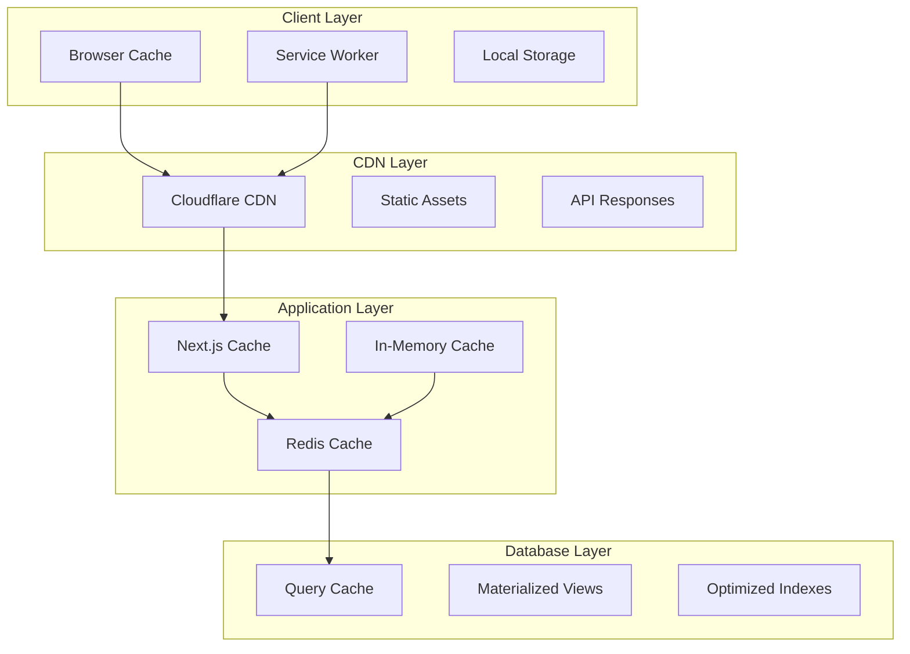

# SteppersLife Events Platform - Performance Optimization Architecture
## Caching, Performance & Scalability Framework
### Version 2.0

---

## Overview

This document defines the comprehensive performance optimization architecture for the SteppersLife events platform, including caching strategies, database optimization, CDN configuration, and scalability patterns designed to support 10,000+ concurrent users.

---

## Performance Goals & Budgets

### Performance Targets

| Metric | Target | Critical Threshold |
|--------|--------|--------------------|
| Time to First Byte (TTFB) | < 200ms | < 500ms |
| Largest Contentful Paint (LCP) | < 1.5s | < 2.5s |
| First Input Delay (FID) | < 100ms | < 300ms |
| Cumulative Layout Shift (CLS) | < 0.1 | < 0.25 |
| Page Load Time | < 1.5s | < 3.0s |
| API Response Time | < 200ms | < 500ms |
| Database Query Time | < 100ms | < 300ms |
| Cache Hit Rate | > 90% | > 80% |

### Resource Budgets

- **JavaScript Bundle**: < 300KB gzipped
- **CSS Bundle**: < 50KB gzipped
- **Images**: WebP format, < 500KB per image
- **Fonts**: WOFF2 format, preloaded
- **Total Page Weight**: < 1MB

---

## Multi-Layer Caching Architecture

### Caching Strategy Overview



### Cache Configuration

```typescript
// lib/cache/cache-manager.ts
import Redis from 'ioredis';
import { LRUCache } from 'lru-cache';

export enum CacheKey {
  // Event caching
  EVENT_LIST = 'events:list',
  EVENT_DETAIL = 'event:detail',
  EVENT_AVAILABILITY = 'event:availability',
  EVENT_STATS = 'event:stats',

  // User caching
  USER_PROFILE = 'user:profile',
  USER_ORDERS = 'user:orders',
  USER_TICKETS = 'user:tickets',

  // Analytics caching
  ANALYTICS_DASHBOARD = 'analytics:dashboard',
  SALES_REPORT = 'analytics:sales',
  ATTENDEE_REPORT = 'analytics:attendees',

  // System caching
  CATEGORIES = 'system:categories',
  VENUES = 'system:venues',
  SETTINGS = 'system:settings',
}

interface CacheConfig {
  ttl: number; // Time to live in seconds
  staleWhileRevalidate?: number; // Background refresh time
  tags?: string[]; // Cache invalidation tags
  compress?: boolean; // Enable compression
}

const CACHE_CONFIGS: Record<CacheKey, CacheConfig> = {
  // Event caching (medium TTL, high invalidation)
  [CacheKey.EVENT_LIST]: { ttl: 300, staleWhileRevalidate: 60, tags: ['events'] },
  [CacheKey.EVENT_DETAIL]: { ttl: 600, staleWhileRevalidate: 120, tags: ['events'] },
  [CacheKey.EVENT_AVAILABILITY]: { ttl: 30, tags: ['events', 'inventory'] },
  [CacheKey.EVENT_STATS]: { ttl: 300, tags: ['events', 'analytics'] },

  // User caching (long TTL, user-specific)
  [CacheKey.USER_PROFILE]: { ttl: 1800, tags: ['users'] },
  [CacheKey.USER_ORDERS]: { ttl: 600, tags: ['users', 'orders'] },
  [CacheKey.USER_TICKETS]: { ttl: 600, tags: ['users', 'tickets'] },

  // Analytics caching (long TTL, scheduled refresh)
  [CacheKey.ANALYTICS_DASHBOARD]: { ttl: 3600, staleWhileRevalidate: 300, tags: ['analytics'] },
  [CacheKey.SALES_REPORT]: { ttl: 1800, tags: ['analytics', 'sales'] },
  [CacheKey.ATTENDEE_REPORT]: { ttl: 3600, tags: ['analytics', 'attendees'] },

  // System caching (very long TTL)
  [CacheKey.CATEGORIES]: { ttl: 86400, tags: ['system'] },
  [CacheKey.VENUES]: { ttl: 3600, tags: ['system', 'venues'] },
  [CacheKey.SETTINGS]: { ttl: 86400, tags: ['system'] },
};

export class CacheManager {
  private redis: Redis;
  private memoryCache: LRUCache<string, any>;
  private compressionThreshold = 1024; // Compress values larger than 1KB

  constructor() {
    this.redis = new Redis({
      host: process.env.REDIS_HOST || 'localhost',
      port: parseInt(process.env.REDIS_PORT || '6379'),
      password: process.env.REDIS_PASSWORD,
      retryDelayOnFailover: 100,
      enableReadyCheck: false,
      maxRetriesPerRequest: 3,
      lazyConnect: true,
      keepAlive: 30000,
      compression: 'gzip',
    });

    this.memoryCache = new LRUCache({
      max: 1000, // Maximum 1000 items
      ttl: 300000, // 5 minutes TTL
      allowStale: true,
      updateAgeOnGet: true,
    });

    this.setupEventHandlers();
  }

  // Get cached value with fallback hierarchy
  async get<T>(key: CacheKey, id?: string): Promise<T | null> {
    const cacheKey = this.buildKey(key, id);

    try {
      // 1. Try memory cache first (fastest)
      const memoryValue = this.memoryCache.get(cacheKey);
      if (memoryValue !== undefined) {
        return memoryValue;
      }

      // 2. Try Redis cache
      const redisValue = await this.redis.get(cacheKey);
      if (redisValue) {
        const parsedValue = this.deserialize(redisValue);

        // Store in memory cache for faster access
        this.memoryCache.set(cacheKey, parsedValue);

        return parsedValue;
      }

      return null;
    } catch (error) {
      console.error('Cache get error:', error);
      return null;
    }
  }

  // Set cached value with compression and TTL
  async set<T>(key: CacheKey, value: T, id?: string, customTtl?: number): Promise<void> {
    const cacheKey = this.buildKey(key, id);
    const config = CACHE_CONFIGS[key];
    const ttl = customTtl || config.ttl;

    try {
      const serializedValue = this.serialize(value);

      // Set in Redis with TTL
      await this.redis.setex(cacheKey, ttl, serializedValue);

      // Set in memory cache
      this.memoryCache.set(cacheKey, value);

      // Add to cache tags for invalidation
      if (config.tags) {
        await this.addToTags(config.tags, cacheKey);
      }

    } catch (error) {
      console.error('Cache set error:', error);
    }
  }

  // Get or set pattern (cache-aside)
  async getOrSet<T>(
    key: CacheKey,
    fetcher: () => Promise<T>,
    id?: string,
    customTtl?: number
  ): Promise<T> {
    const cachedValue = await this.get<T>(key, id);

    if (cachedValue !== null) {
      return cachedValue;
    }

    const freshValue = await fetcher();
    await this.set(key, freshValue, id, customTtl);

    return freshValue;
  }

  // Invalidate by key
  async invalidate(key: CacheKey, id?: string): Promise<void> {
    const cacheKey = this.buildKey(key, id);

    try {
      await this.redis.del(cacheKey);
      this.memoryCache.delete(cacheKey);
    } catch (error) {
      console.error('Cache invalidation error:', error);
    }
  }

  // Invalidate by tags
  async invalidateByTags(tags: string[]): Promise<void> {
    try {
      const keys: string[] = [];

      for (const tag of tags) {
        const tagKeys = await this.redis.smembers(`tag:${tag}`);
        keys.push(...tagKeys);
      }

      if (keys.length > 0) {
        await this.redis.del(...keys);

        // Clear from memory cache
        for (const key of keys) {
          this.memoryCache.delete(key);
        }

        // Clean up tag sets
        for (const tag of tags) {
          await this.redis.del(`tag:${tag}`);
        }
      }
    } catch (error) {
      console.error('Tag invalidation error:', error);
    }
  }

  // Stale-while-revalidate pattern
  async getStaleWhileRevalidate<T>(
    key: CacheKey,
    fetcher: () => Promise<T>,
    id?: string
  ): Promise<T> {
    const cacheKey = this.buildKey(key, id);
    const config = CACHE_CONFIGS[key];

    try {
      const [value, ttl] = await this.redis.multi()
        .get(cacheKey)
        .ttl(cacheKey)
        .exec();

      if (value && value[1]) {
        const parsedValue = this.deserialize(value[1] as string);

        // If TTL is within stale-while-revalidate window, refresh in background
        if (config.staleWhileRevalidate && ttl && ttl[1] as number < config.staleWhileRevalidate) {
          // Background refresh
          setImmediate(async () => {
            try {
              const freshValue = await fetcher();
              await this.set(key, freshValue, id);
            } catch (error) {
              console.error('Background refresh error:', error);
            }
          });
        }

        return parsedValue;
      }

      // Cache miss - fetch fresh data
      const freshValue = await fetcher();
      await this.set(key, freshValue, id);

      return freshValue;
    } catch (error) {
      console.error('Stale-while-revalidate error:', error);
      // Fallback to direct fetch
      return await fetcher();
    }
  }

  // Batch operations
  async getBatch<T>(keys: Array<{ key: CacheKey; id?: string }>): Promise<Array<T | null>> {
    const cacheKeys = keys.map(k => this.buildKey(k.key, k.id));

    try {
      const values = await this.redis.mget(...cacheKeys);
      return values.map(value => value ? this.deserialize(value) : null);
    } catch (error) {
      console.error('Batch get error:', error);
      return new Array(keys.length).fill(null);
    }
  }

  async setBatch<T>(items: Array<{ key: CacheKey; value: T; id?: string; ttl?: number }>): Promise<void> {
    const pipeline = this.redis.pipeline();

    for (const item of items) {
      const cacheKey = this.buildKey(item.key, item.id);
      const config = CACHE_CONFIGS[item.key];
      const ttl = item.ttl || config.ttl;
      const serializedValue = this.serialize(item.value);

      pipeline.setex(cacheKey, ttl, serializedValue);
    }

    try {
      await pipeline.exec();
    } catch (error) {
      console.error('Batch set error:', error);
    }
  }

  // Cache warming
  async warmCache(): Promise<void> {
    console.log('Warming cache...');

    try {
      // Warm categories
      const categories = await this.getOrSet(
        CacheKey.CATEGORIES,
        async () => {
          const { default: prisma } = await import('@/lib/prisma');
          return await prisma.eventCategory.findMany({
            where: { isActive: true },
            orderBy: { sortOrder: 'asc' },
          });
        }
      );

      // Warm featured events
      await this.getOrSet(
        CacheKey.EVENT_LIST,
        async () => {
          const { default: prisma } = await import('@/lib/prisma');
          return await prisma.event.findMany({
            where: {
              status: 'PUBLISHED',
              isFeatured: true,
            },
            include: {
              ticketTypes: {
                where: { isActive: true },
                select: {
                  id: true,
                  name: true,
                  price: true,
                  quantity: true,
                  sold: true,
                },
              },
              venue: {
                select: {
                  name: true,
                  city: true,
                  state: true,
                },
              },
            },
            take: 10,
            orderBy: { startDate: 'asc' },
          });
        },
        'featured'
      );

      console.log('Cache warming completed');
    } catch (error) {
      console.error('Cache warming error:', error);
    }
  }

  // Private helper methods
  private buildKey(key: CacheKey, id?: string): string {
    return id ? `${key}:${id}` : key;
  }

  private serialize(value: any): string {
    const stringValue = JSON.stringify(value);

    // Compress large values
    if (stringValue.length > this.compressionThreshold) {
      const zlib = require('zlib');
      return zlib.gzipSync(stringValue).toString('base64');
    }

    return stringValue;
  }

  private deserialize(value: string): any {
    try {
      // Check if compressed (base64 encoded)
      if (value.length > 100 && /^[A-Za-z0-9+/=]+$/.test(value)) {
        try {
          const zlib = require('zlib');
          const decompressed = zlib.gunzipSync(Buffer.from(value, 'base64')).toString();
          return JSON.parse(decompressed);
        } catch {
          // Fallback to regular parsing
          return JSON.parse(value);
        }
      }

      return JSON.parse(value);
    } catch (error) {
      console.error('Deserialization error:', error);
      return null;
    }
  }

  private async addToTags(tags: string[], cacheKey: string): Promise<void> {
    const pipeline = this.redis.pipeline();

    for (const tag of tags) {
      pipeline.sadd(`tag:${tag}`, cacheKey);
      pipeline.expire(`tag:${tag}`, 86400); // Expire tag sets after 24 hours
    }

    await pipeline.exec();
  }

  private setupEventHandlers(): void {
    this.redis.on('error', (error) => {
      console.error('Redis connection error:', error);
    });

    this.redis.on('connect', () => {
      console.log('Redis connected');
    });

    this.redis.on('ready', () => {
      console.log('Redis ready');
      // Start cache warming on connection
      this.warmCache();
    });
  }

  // Statistics and monitoring
  async getStats(): Promise<CacheStats> {
    try {
      const info = await this.redis.info('memory');
      const keyCount = await this.redis.dbsize();

      return {
        redisMemoryUsage: this.parseRedisInfo(info, 'used_memory_human'),
        redisKeys: keyCount,
        memoryCache: {
          size: this.memoryCache.size,
          max: this.memoryCache.max,
          calculatedSize: this.memoryCache.calculatedSize,
        },
      };
    } catch (error) {
      console.error('Cache stats error:', error);
      return {
        redisMemoryUsage: 'Unknown',
        redisKeys: 0,
        memoryCache: {
          size: this.memoryCache.size,
          max: this.memoryCache.max,
          calculatedSize: this.memoryCache.calculatedSize,
        },
      };
    }
  }

  private parseRedisInfo(info: string, key: string): string {
    const lines = info.split('\r\n');
    const line = lines.find(l => l.startsWith(`${key}:`));
    return line ? line.split(':')[1] : 'Unknown';
  }
}

interface CacheStats {
  redisMemoryUsage: string;
  redisKeys: number;
  memoryCache: {
    size: number;
    max: number;
    calculatedSize: number;
  };
}

export const cacheManager = new CacheManager();
```

---

## Database Optimization

### Query Optimization Framework

```typescript
// lib/database/query-optimizer.ts
import { Prisma } from '@prisma/client';
import { logger } from '@/lib/logger';

export class QueryOptimizer {
  // Optimized event queries with includes
  static getOptimizedEventQuery(includeOptions: EventIncludeOptions = {}): Prisma.EventFindManyArgs {
    return {
      select: {
        id: true,
        name: true,
        slug: true,
        description: includeOptions.fullDescription ? true : false,
        shortDescription: true,
        startDate: true,
        endDate: true,
        timezone: true,
        eventType: true,
        status: true,
        visibility: true,
        isFeatured: true,
        coverImage: true,
        maxCapacity: true,
        createdAt: true,
        updatedAt: true,

        // Conditional includes based on needs
        ...(includeOptions.ticketTypes && {
          ticketTypes: {
            where: { isActive: true },
            select: {
              id: true,
              name: true,
              description: true,
              price: true,
              quantity: true,
              sold: true,
              reserved: true,
              minPerOrder: true,
              maxPerOrder: true,
              salesStartDate: true,
              salesEndDate: true,
              requiresSeat: true,
            },
            orderBy: { sortOrder: 'asc' },
          },
        }),

        ...(includeOptions.venue && {
          venue: {
            select: {
              id: true,
              name: true,
              address: true,
              city: true,
              state: true,
              zipCode: true,
              maxCapacity: true,
              hasSeating: true,
              hasParking: true,
              isAccessible: true,
            },
          },
        }),

        ...(includeOptions.organizer && {
          organizer: {
            select: {
              id: true,
              firstName: true,
              lastName: true,
              profileImage: true,
              organizerProfile: {
                select: {
                  businessName: true,
                  isVerified: true,
                  averageRating: true,
                },
              },
            },
          },
        }),

        ...(includeOptions.categories && {
          categories: {
            select: {
              id: true,
              name: true,
              slug: true,
              color: true,
              icon: true,
            },
          },
        }),

        // Aggregated counts for performance
        _count: {
          select: {
            orders: includeOptions.stats ? { where: { status: 'COMPLETED' } } : false,
            favorites: includeOptions.stats,
            reviews: includeOptions.stats,
          },
        },
      },
    };
  }

  // Paginated and filtered event query
  static async getEventsList(
    filters: EventFilters,
    pagination: PaginationOptions
  ): Promise<EventListResult> {
    const { page = 1, limit = 20 } = pagination;
    const offset = (page - 1) * limit;

    // Build where clause dynamically
    const where: Prisma.EventWhereInput = {
      status: 'PUBLISHED',
      visibility: 'PUBLIC',
      startDate: { gte: new Date() }, // Only future events

      // Category filter
      ...(filters.category && {
        categories: {
          some: { slug: filters.category },
        },
      }),

      // Location filters
      ...(filters.city && {
        venue: { city: { contains: filters.city, mode: 'insensitive' } },
      }),
      ...(filters.state && {
        venue: { state: filters.state },
      }),

      // Date range filters
      ...(filters.dateFrom && {
        startDate: { gte: filters.dateFrom },
      }),
      ...(filters.dateTo && {
        startDate: { lte: filters.dateTo },
      }),

      // Search filter (full-text search)
      ...(filters.search && {
        OR: [
          { name: { contains: filters.search, mode: 'insensitive' } },
          { description: { contains: filters.search, mode: 'insensitive' } },
          { venue: { name: { contains: filters.search, mode: 'insensitive' } } },
        ],
      }),

      // Featured filter
      ...(filters.featured && { isFeatured: true }),
    };

    // Build order by clause
    const orderBy: Prisma.EventOrderByWithRelationInput[] = [];

    switch (filters.sortBy) {
      case 'date':
        orderBy.push({ startDate: filters.sortOrder || 'asc' });
        break;
      case 'name':
        orderBy.push({ name: filters.sortOrder || 'asc' });
        break;
      case 'popularity':
        // Sort by ticket sales
        orderBy.push({
          orders: {
            _count: filters.sortOrder || 'desc',
          },
        });
        break;
      case 'price':
        // Sort by minimum ticket price
        orderBy.push({
          ticketTypes: {
            _min: { price: filters.sortOrder || 'asc' },
          },
        });
        break;
      default:
        orderBy.push({ startDate: 'asc' });
    }

    // Execute optimized query
    const queryOptions = this.getOptimizedEventQuery({
      ticketTypes: true,
      venue: true,
      stats: true,
    });

    const [events, total] = await Promise.all([
      prisma.event.findMany({
        ...queryOptions,
        where,
        orderBy,
        skip: offset,
        take: limit,
      }),
      prisma.event.count({ where }),
    ]);

    return {
      events,
      pagination: {
        page,
        limit,
        total,
        pages: Math.ceil(total / limit),
        hasNext: page * limit < total,
        hasPrev: page > 1,
      },
    };
  }

  // Optimized order queries
  static async getOrderWithDetails(orderId: string): Promise<DetailedOrder | null> {
    return await prisma.order.findUnique({
      where: { id: orderId },
      select: {
        id: true,
        orderNumber: true,
        email: true,
        firstName: true,
        lastName: true,
        phone: true,
        subtotal: true,
        fees: true,
        taxes: true,
        total: true,
        status: true,
        paymentStatus: true,
        squarePaymentId: true,
        squareReceiptUrl: true,
        createdAt: true,
        completedAt: true,

        event: {
          select: {
            id: true,
            name: true,
            slug: true,
            startDate: true,
            endDate: true,
            coverImage: true,
            venue: {
              select: {
                name: true,
                address: true,
                city: true,
                state: true,
              },
            },
          },
        },

        tickets: {
          select: {
            id: true,
            ticketNumber: true,
            qrCode: true,
            status: true,
            faceValue: true,
            holderName: true,
            holderEmail: true,
            checkedIn: true,
            checkedInAt: true,

            ticketType: {
              select: {
                name: true,
                description: true,
              },
            },

            seat: {
              select: {
                section: true,
                row: true,
                number: true,
              },
            },
          },
          orderBy: { createdAt: 'asc' },
        },

        payment: {
          select: {
            id: true,
            amount: true,
            method: true,
            status: true,
            cardBrand: true,
            cardLast4: true,
            processorFee: true,
            netAmount: true,
            processedAt: true,
          },
        },

        refunds: {
          select: {
            id: true,
            amount: true,
            reason: true,
            status: true,
            processedAt: true,
          },
          orderBy: { createdAt: 'desc' },
        },
      },
    });
  }

  // Analytics queries with aggregations
  static async getDashboardStats(
    organizerId: string,
    timeframe: '7d' | '30d' | '90d' | '1y'
  ): Promise<DashboardStats> {
    const startDate = this.getTimeframeStartDate(timeframe);

    // Use raw SQL for complex aggregations
    const salesStats = await prisma.$queryRaw<Array<{
      total_revenue: number;
      total_orders: number;
      total_tickets: number;
      avg_order_value: number;
    }>>`
      SELECT
        COALESCE(SUM(o.total), 0) as total_revenue,
        COUNT(o.id) as total_orders,
        COUNT(t.id) as total_tickets,
        COALESCE(AVG(o.total), 0) as avg_order_value
      FROM orders o
      LEFT JOIN tickets t ON t.order_id = o.id
      LEFT JOIN events e ON e.id = o.event_id
      WHERE e.organizer_id = ${organizerId}
        AND o.status = 'COMPLETED'
        AND o.created_at >= ${startDate}
    `;

    // Event performance query
    const eventPerformance = await prisma.$queryRaw<Array<{
      event_id: string;
      event_name: string;
      revenue: number;
      tickets_sold: number;
      conversion_rate: number;
    }>>`
      SELECT
        e.id as event_id,
        e.name as event_name,
        COALESCE(SUM(o.total), 0) as revenue,
        COUNT(t.id) as tickets_sold,
        CASE
          WHEN COUNT(DISTINCT o.id) > 0
          THEN (COUNT(CASE WHEN o.status = 'COMPLETED' THEN 1 END)::float / COUNT(DISTINCT o.id)::float) * 100
          ELSE 0
        END as conversion_rate
      FROM events e
      LEFT JOIN orders o ON o.event_id = e.id AND o.created_at >= ${startDate}
      LEFT JOIN tickets t ON t.order_id = o.id
      WHERE e.organizer_id = ${organizerId}
        AND e.start_date >= NOW()
      GROUP BY e.id, e.name
      ORDER BY revenue DESC
      LIMIT 10
    `;

    return {
      sales: salesStats[0] || {
        total_revenue: 0,
        total_orders: 0,
        total_tickets: 0,
        avg_order_value: 0,
      },
      topEvents: eventPerformance,
      timeframe,
      generatedAt: new Date(),
    };
  }

  private static getTimeframeStartDate(timeframe: string): Date {
    const now = new Date();
    switch (timeframe) {
      case '7d':
        return new Date(now.getTime() - 7 * 24 * 60 * 60 * 1000);
      case '30d':
        return new Date(now.getTime() - 30 * 24 * 60 * 60 * 1000);
      case '90d':
        return new Date(now.getTime() - 90 * 24 * 60 * 60 * 1000);
      case '1y':
        return new Date(now.getTime() - 365 * 24 * 60 * 60 * 1000);
      default:
        return new Date(now.getTime() - 30 * 24 * 60 * 60 * 1000);
    }
  }
}

// Database connection optimization
export class DatabaseOptimizer {
  static async optimizeConnection(): Promise<void> {
    // Set connection pool settings
    await prisma.$executeRaw`SET SESSION work_mem = '256MB'`;
    await prisma.$executeRaw`SET SESSION random_page_cost = 1.1`;
    await prisma.$executeRaw`SET SESSION effective_cache_size = '4GB'`;
    await prisma.$executeRaw`SET SESSION shared_preload_libraries = 'pg_stat_statements'`;
  }

  static async createOptimizedIndexes(): Promise<void> {
    const indexes = [
      // Event indexes for filtering and sorting
      `CREATE INDEX CONCURRENTLY IF NOT EXISTS idx_events_published_date
       ON events(status, visibility, start_date)
       WHERE status = 'PUBLISHED' AND visibility = 'PUBLIC'`,

      // Full-text search index
      `CREATE INDEX CONCURRENTLY IF NOT EXISTS idx_events_search
       ON events USING gin(to_tsvector('english', name || ' ' || COALESCE(description, '')))`,

      // Order performance indexes
      `CREATE INDEX CONCURRENTLY IF NOT EXISTS idx_orders_event_status
       ON orders(event_id, status, created_at)`,

      // Ticket lookup indexes
      `CREATE INDEX CONCURRENTLY IF NOT EXISTS idx_tickets_qr_status
       ON tickets(qr_code, status)
       WHERE status IN ('VALID', 'USED')`,

      // Analytics indexes
      `CREATE INDEX CONCURRENTLY IF NOT EXISTS idx_orders_organizer_analytics
       ON orders(event_id, status, created_at, total)
       WHERE status = 'COMPLETED'`,

      // User activity indexes
      `CREATE INDEX CONCURRENTLY IF NOT EXISTS idx_users_activity
       ON users(role, status, last_login_at)`,

      // Composite index for event filtering
      `CREATE INDEX CONCURRENTLY IF NOT EXISTS idx_events_filter_composite
       ON events(status, visibility, start_date, is_featured)`,
    ];

    for (const indexSql of indexes) {
      try {
        await prisma.$executeRawUnsafe(indexSql);
        console.log('Index created successfully');
      } catch (error) {
        console.error('Index creation error:', error);
      }
    }
  }

  static async analyzeTableStats(): Promise<void> {
    const tables = ['events', 'orders', 'tickets', 'users', 'ticket_types'];

    for (const table of tables) {
      await prisma.$executeRawUnsafe(`ANALYZE ${table}`);
    }

    console.log('Table statistics updated');
  }
}

// Types
interface EventIncludeOptions {
  ticketTypes?: boolean;
  venue?: boolean;
  organizer?: boolean;
  categories?: boolean;
  fullDescription?: boolean;
  stats?: boolean;
}

interface EventFilters {
  category?: string;
  city?: string;
  state?: string;
  dateFrom?: Date;
  dateTo?: Date;
  search?: string;
  featured?: boolean;
  sortBy?: 'date' | 'name' | 'popularity' | 'price';
  sortOrder?: 'asc' | 'desc';
}

interface PaginationOptions {
  page?: number;
  limit?: number;
}

interface EventListResult {
  events: any[];
  pagination: {
    page: number;
    limit: number;
    total: number;
    pages: number;
    hasNext: boolean;
    hasPrev: boolean;
  };
}
```

---

## CDN & Asset Optimization

### Cloudflare Configuration

```typescript
// lib/cdn/cloudflare-config.ts

export const CLOUDFLARE_CONFIG = {
  // Page Rules for caching
  pageRules: [
    {
      url: '*.stepperslife.com/_next/static/*',
      settings: {
        cacheLevel: 'cache_everything',
        edgeCacheTtl: 31536000, // 1 year
        browserCacheTtl: 31536000,
      },
    },
    {
      url: '*.stepperslife.com/api/public/*',
      settings: {
        cacheLevel: 'cache_everything',
        edgeCacheTtl: 300, // 5 minutes
        browserCacheTtl: 300,
      },
    },
    {
      url: '*.stepperslife.com/images/*',
      settings: {
        cacheLevel: 'cache_everything',
        edgeCacheTtl: 86400, // 24 hours
        browserCacheTtl: 86400,
        polish: 'lossy',
        mirage: true,
      },
    },
  ],

  // Cache purging configuration
  purgeRules: {
    // Purge event-related cache when events are updated
    events: [
      '/api/public/events/*',
      '/events/*',
      '/',
    ],
    // Purge user cache when user data changes
    users: [
      '/api/user/*',
      '/profile/*',
    ],
  },

  // Worker configuration for edge computing
  workers: {
    imageOptimization: `
      addEventListener('fetch', event => {
        event.respondWith(handleRequest(event.request))
      })

      async function handleRequest(request) {
        const url = new URL(request.url)

        // Image optimization at edge
        if (url.pathname.startsWith('/images/')) {
          const imageRequest = new Request(url.toString(), {
            cf: {
              image: {
                format: 'webp',
                quality: 85,
                fit: 'scale-down',
                width: 1200,
                height: 800,
              }
            }
          })

          return fetch(imageRequest)
        }

        return fetch(request)
      }
    `,

    apiCaching: `
      addEventListener('fetch', event => {
        event.respondWith(handleRequest(event.request))
      })

      async function handleRequest(request) {
        const url = new URL(request.url)

        // Cache API responses at edge
        if (url.pathname.startsWith('/api/public/')) {
          const cache = caches.default
          const cacheKey = new Request(url.toString(), request)

          let response = await cache.match(cacheKey)

          if (!response) {
            response = await fetch(request)

            if (response.status === 200) {
              const responseToCache = response.clone()
              responseToCache.headers.set('Cache-Control', 'public, max-age=300')
              event.waitUntil(cache.put(cacheKey, responseToCache))
            }
          }

          return response
        }

        return fetch(request)
      }
    `,
  },
};

// CDN Cache Management
export class CDNCacheManager {
  private apiToken: string;
  private zoneId: string;

  constructor() {
    this.apiToken = process.env.CLOUDFLARE_API_TOKEN!;
    this.zoneId = process.env.CLOUDFLARE_ZONE_ID!;
  }

  async purgeCache(files?: string[]): Promise<void> {
    const url = `https://api.cloudflare.com/client/v4/zones/${this.zoneId}/purge_cache`;

    const body = files
      ? { files }
      : { purge_everything: true };

    try {
      const response = await fetch(url, {
        method: 'POST',
        headers: {
          'Authorization': `Bearer ${this.apiToken}`,
          'Content-Type': 'application/json',
        },
        body: JSON.stringify(body),
      });

      if (!response.ok) {
        throw new Error(`CDN purge failed: ${response.statusText}`);
      }

      console.log('CDN cache purged successfully');
    } catch (error) {
      console.error('CDN purge error:', error);
    }
  }

  async purgeByTags(tags: string[]): Promise<void> {
    const url = `https://api.cloudflare.com/client/v4/zones/${this.zoneId}/purge_cache`;

    try {
      const response = await fetch(url, {
        method: 'POST',
        headers: {
          'Authorization': `Bearer ${this.apiToken}`,
          'Content-Type': 'application/json',
        },
        body: JSON.stringify({ tags }),
      });

      if (!response.ok) {
        throw new Error(`CDN tag purge failed: ${response.statusText}`);
      }

      console.log('CDN cache purged by tags:', tags);
    } catch (error) {
      console.error('CDN tag purge error:', error);
    }
  }

  async getCacheAnalytics(): Promise<CacheAnalytics> {
    const url = `https://api.cloudflare.com/client/v4/zones/${this.zoneId}/analytics/dashboard`;

    try {
      const response = await fetch(url, {
        headers: {
          'Authorization': `Bearer ${this.apiToken}`,
        },
      });

      if (!response.ok) {
        throw new Error(`Analytics fetch failed: ${response.statusText}`);
      }

      const data = await response.json();
      return data.result;
    } catch (error) {
      console.error('Cache analytics error:', error);
      throw error;
    }
  }
}

interface CacheAnalytics {
  totals: {
    requests: {
      cached: number;
      uncached: number;
    };
    bandwidth: {
      cached: number;
      uncached: number;
    };
  };
  since: string;
  until: string;
}

export const cdnManager = new CDNCacheManager();
```

---

## Performance Monitoring

### Performance Metrics Collection

```typescript
// lib/performance/performance-monitor.ts
import { logger } from '@/lib/logger';

export class PerformanceMonitor {
  private static metrics = new Map<string, PerformanceEntry[]>();

  // Core Web Vitals tracking
  static trackWebVitals(metric: WebVital): void {
    // Send to analytics
    if (typeof window !== 'undefined') {
      // Google Analytics 4
      gtag('event', metric.name, {
        event_category: 'Web Vitals',
        event_label: metric.id,
        value: Math.round(metric.name === 'CLS' ? metric.value * 1000 : metric.value),
        non_interaction: true,
        custom_map: {
          metric_id: metric.id,
          metric_value: metric.value,
          metric_delta: metric.delta,
          metric_rating: metric.rating,
        },
      });

      // Send to our analytics
      fetch('/api/analytics/web-vitals', {
        method: 'POST',
        headers: { 'Content-Type': 'application/json' },
        body: JSON.stringify({
          name: metric.name,
          value: metric.value,
          id: metric.id,
          delta: metric.delta,
          rating: metric.rating,
          url: window.location.href,
          userAgent: navigator.userAgent,
          timestamp: Date.now(),
        }),
      }).catch(console.error);
    }
  }

  // API response time tracking
  static startTimer(label: string): string {
    const id = `${label}-${Date.now()}-${Math.random()}`;
    performance.mark(`${id}-start`);
    return id;
  }

  static endTimer(id: string): number {
    performance.mark(`${id}-end`);
    performance.measure(id, `${id}-start`, `${id}-end`);

    const measure = performance.getEntriesByName(id)[0];
    const duration = measure.duration;

    // Log slow operations
    if (duration > 1000) {
      logger.warn('Slow operation detected', {
        operation: id,
        duration,
      });
    }

    // Store metrics
    const existing = this.metrics.get('api-timings') || [];
    existing.push(measure);
    this.metrics.set('api-timings', existing);

    // Clean up
    performance.clearMarks(`${id}-start`);
    performance.clearMarks(`${id}-end`);
    performance.clearMeasures(id);

    return duration;
  }

  // Database query performance tracking
  static trackDatabaseQuery(query: string, duration: number, recordCount?: number): void {
    const metric = {
      query,
      duration,
      recordCount,
      timestamp: Date.now(),
    };

    logger.info('Database query performance', metric);

    // Alert on slow queries
    if (duration > 500) {
      logger.warn('Slow database query', metric);
    }

    // Store for aggregation
    const existing = this.metrics.get('db-queries') || [];
    existing.push(metric as any);
    this.metrics.set('db-queries', existing);
  }

  // Memory usage tracking
  static trackMemoryUsage(): MemoryUsage | null {
    if (typeof process !== 'undefined' && process.memoryUsage) {
      const usage = process.memoryUsage();

      // Convert to MB
      const memoryMB = {
        rss: Math.round(usage.rss / 1024 / 1024),
        heapTotal: Math.round(usage.heapTotal / 1024 / 1024),
        heapUsed: Math.round(usage.heapUsed / 1024 / 1024),
        external: Math.round(usage.external / 1024 / 1024),
      };

      // Alert on high memory usage
      if (memoryMB.heapUsed > 500) {
        logger.warn('High memory usage detected', memoryMB);
      }

      return memoryMB;
    }

    return null;
  }

  // Cache performance tracking
  static trackCachePerformance(operation: string, hit: boolean, duration: number): void {
    const metric = {
      operation,
      hit,
      duration,
      timestamp: Date.now(),
    };

    const existing = this.metrics.get('cache-performance') || [];
    existing.push(metric as any);
    this.metrics.set('cache-performance', existing);

    // Calculate hit rate
    const cacheMetrics = this.metrics.get('cache-performance') || [];
    const recentMetrics = cacheMetrics.slice(-100); // Last 100 operations
    const hitRate = recentMetrics.filter((m: any) => m.hit).length / recentMetrics.length;

    if (hitRate < 0.8) {
      logger.warn('Low cache hit rate', { hitRate, operation });
    }
  }

  // Get performance summary
  static getPerformanceSummary(): PerformanceSummary {
    const apiTimings = this.metrics.get('api-timings') || [];
    const dbQueries = this.metrics.get('db-queries') || [];
    const cacheMetrics = this.metrics.get('cache-performance') || [];

    // Calculate API timing stats
    const apiDurations = apiTimings.map(m => m.duration);
    const apiStats = this.calculateStats(apiDurations);

    // Calculate DB query stats
    const dbDurations = dbQueries.map((m: any) => m.duration);
    const dbStats = this.calculateStats(dbDurations);

    // Calculate cache hit rate
    const cacheHits = cacheMetrics.filter((m: any) => m.hit).length;
    const cacheTotal = cacheMetrics.length;
    const cacheHitRate = cacheTotal > 0 ? cacheHits / cacheTotal : 0;

    return {
      api: {
        ...apiStats,
        requestCount: apiTimings.length,
      },
      database: {
        ...dbStats,
        queryCount: dbQueries.length,
      },
      cache: {
        hitRate: cacheHitRate,
        totalOperations: cacheTotal,
      },
      memory: this.trackMemoryUsage(),
      generatedAt: new Date(),
    };
  }

  private static calculateStats(values: number[]): Stats {
    if (values.length === 0) {
      return { min: 0, max: 0, avg: 0, p95: 0, p99: 0 };
    }

    const sorted = values.sort((a, b) => a - b);
    const sum = values.reduce((a, b) => a + b, 0);

    return {
      min: sorted[0],
      max: sorted[sorted.length - 1],
      avg: sum / values.length,
      p95: sorted[Math.floor(sorted.length * 0.95)],
      p99: sorted[Math.floor(sorted.length * 0.99)],
    };
  }

  // Reset metrics (called periodically)
  static resetMetrics(): void {
    this.metrics.clear();
  }
}

// React hook for performance monitoring
export function usePerformanceMonitor() {
  const [metrics, setMetrics] = useState<PerformanceSummary | null>(null);

  useEffect(() => {
    const interval = setInterval(() => {
      const summary = PerformanceMonitor.getPerformanceSummary();
      setMetrics(summary);
    }, 30000); // Update every 30 seconds

    return () => clearInterval(interval);
  }, []);

  return metrics;
}

// Types
interface WebVital {
  name: string;
  value: number;
  id: string;
  delta: number;
  rating: 'good' | 'needs-improvement' | 'poor';
}

interface MemoryUsage {
  rss: number;
  heapTotal: number;
  heapUsed: number;
  external: number;
}

interface Stats {
  min: number;
  max: number;
  avg: number;
  p95: number;
  p99: number;
}

interface PerformanceSummary {
  api: Stats & { requestCount: number };
  database: Stats & { queryCount: number };
  cache: {
    hitRate: number;
    totalOperations: number;
  };
  memory: MemoryUsage | null;
  generatedAt: Date;
}

export { PerformanceMonitor };
```

This comprehensive performance optimization architecture provides:

1. **Multi-layer Caching** with Redis, memory cache, and CDN
2. **Database Optimization** with query optimization and indexing
3. **CDN Configuration** with Cloudflare for global performance
4. **Performance Monitoring** with real-time metrics and alerting
5. **Asset Optimization** with compression and efficient delivery
6. **Cache Invalidation** strategies for data consistency
7. **Performance Budgets** and targets for accountability
8. **Scalability Patterns** for handling high traffic

The architecture is designed to deliver sub-1.5 second page loads and support 10,000+ concurrent users while maintaining excellent user experience.