# SteppersLife Events Platform - System Architecture Diagrams
## Component Architecture & Data Flow Models
### Version 2.0

---

## Overview

This document provides comprehensive system architecture diagrams and data flow models for the SteppersLife events platform, illustrating the complete system design from high-level architecture to detailed component interactions.

---

## High-Level System Architecture

### Overall System Overview

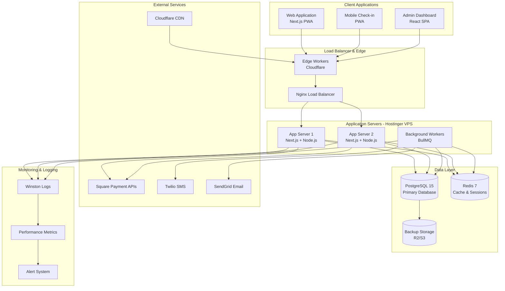
```mermaid
graph TB
    subgraph "External Services"
        SQUARE[Square Payment APIs]
        TWILIO[Twilio SMS]
        SENDGRID[SendGrid Email]
        CLOUDFLARE[Cloudflare CDN]
    end

    subgraph "Client Applications"
        WEB[Web Application<br/>Next.js PWA]
        MOBILE[Mobile Check-in<br/>PWA]
        ADMIN[Admin Dashboard<br/>React SPA]
    end

    subgraph "Load Balancer & Edge"
        LB[Nginx Load Balancer]
        EDGE[Edge Workers<br/>Cloudflare]
    end

    subgraph "Application Servers - Hostinger VPS"
        APP1[App Server 1<br/>Next.js + Node.js]
        APP2[App Server 2<br/>Next.js + Node.js]
        WORKER[Background Workers<br/>BullMQ]
    end

    subgraph "Data Layer"
        POSTGRES[(PostgreSQL 15<br/>Primary Database)]
        REDIS[(Redis 7<br/>Cache & Sessions)]
        BACKUP[(Backup Storage<br/>R2/S3)]
    end

    subgraph "Monitoring & Logging"
        LOGS[Winston Logs]
        METRICS[Performance Metrics]
        ALERTS[Alert System]
    end

    WEB --> EDGE
    MOBILE --> EDGE
    ADMIN --> EDGE

    EDGE --> LB
    LB --> APP1
    LB --> APP2

    APP1 --> POSTGRES
    APP1 --> REDIS
    APP2 --> POSTGRES
    APP2 --> REDIS

    WORKER --> POSTGRES
    WORKER --> REDIS
    WORKER --> TWILIO
    WORKER --> SENDGRID

    APP1 --> SQUARE
    APP2 --> SQUARE

    CLOUDFLARE --> EDGE

    POSTGRES --> BACKUP

    APP1 --> LOGS
    APP2 --> LOGS
    WORKER --> LOGS

    LOGS --> METRICS
    METRICS --> ALERTS
```

---

## Application Layer Architecture

### Next.js Application Structure

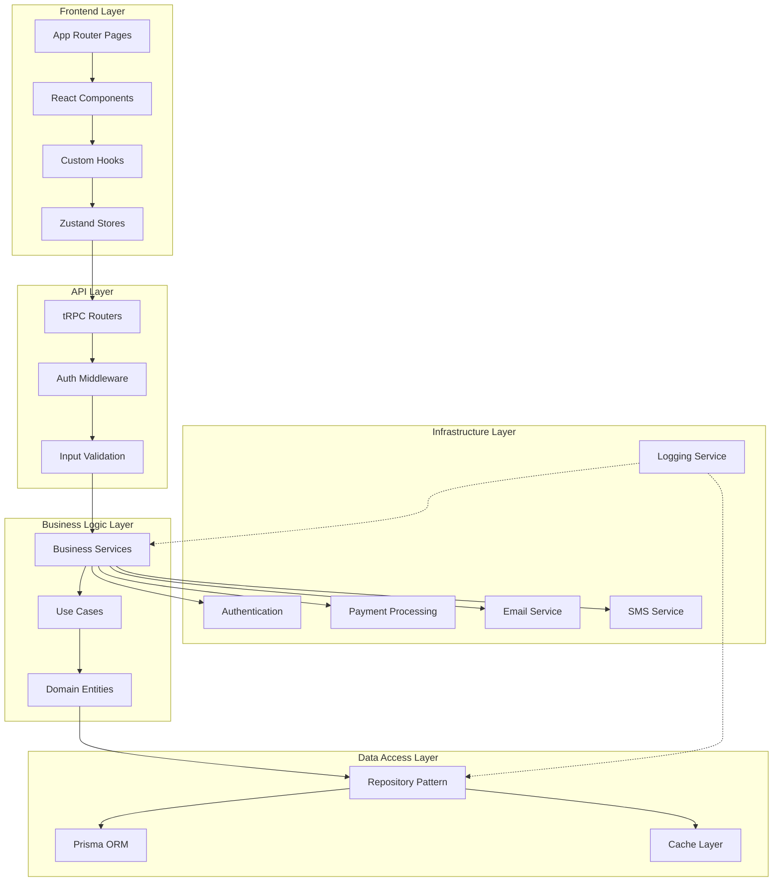
```mermaid
graph TB
    subgraph "Frontend Layer"
        PAGES[App Router Pages]
        COMPONENTS[React Components]
        HOOKS[Custom Hooks]
        STORES[Zustand Stores]
    end

    subgraph "API Layer"
        TRPC[tRPC Routers]
        MIDDLEWARE[Auth Middleware]
        VALIDATION[Input Validation]
    end

    subgraph "Business Logic Layer"
        SERVICES[Business Services]
        USECASES[Use Cases]
        ENTITIES[Domain Entities]
    end

    subgraph "Data Access Layer"
        REPOSITORIES[Repository Pattern]
        PRISMA[Prisma ORM]
        CACHE[Cache Layer]
    end

    subgraph "Infrastructure Layer"
        AUTH[Authentication]
        PAYMENTS[Payment Processing]
        EMAIL[Email Service]
        SMS[SMS Service]
        LOGGER[Logging Service]
    end

    PAGES --> COMPONENTS
    COMPONENTS --> HOOKS
    HOOKS --> STORES
    STORES --> TRPC

    TRPC --> MIDDLEWARE
    MIDDLEWARE --> VALIDATION
    VALIDATION --> SERVICES

    SERVICES --> USECASES
    USECASES --> ENTITIES
    ENTITIES --> REPOSITORIES

    REPOSITORIES --> PRISMA
    REPOSITORIES --> CACHE

    SERVICES --> AUTH
    SERVICES --> PAYMENTS
    SERVICES --> EMAIL
    SERVICES --> SMS

    LOGGER -.-> SERVICES
    LOGGER -.-> REPOSITORIES
```

### Component Interaction Model

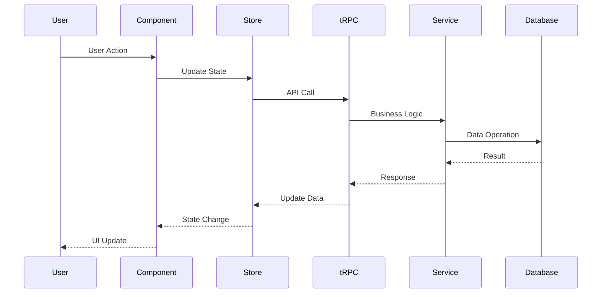
```mermaid
sequenceDiagram
    participant User
    participant Component
    participant Store
    participant tRPC
    participant Service
    participant Database

    User->>Component: User Action
    Component->>Store: Update State
    Store->>tRPC: API Call
    tRPC->>Service: Business Logic
    Service->>Database: Data Operation
    Database-->>Service: Result
    Service-->>tRPC: Response
    tRPC-->>Store: Update Data
    Store-->>Component: State Change
    Component-->>User: UI Update
```

---

## Data Flow Architecture

### Event Ticket Purchase Flow

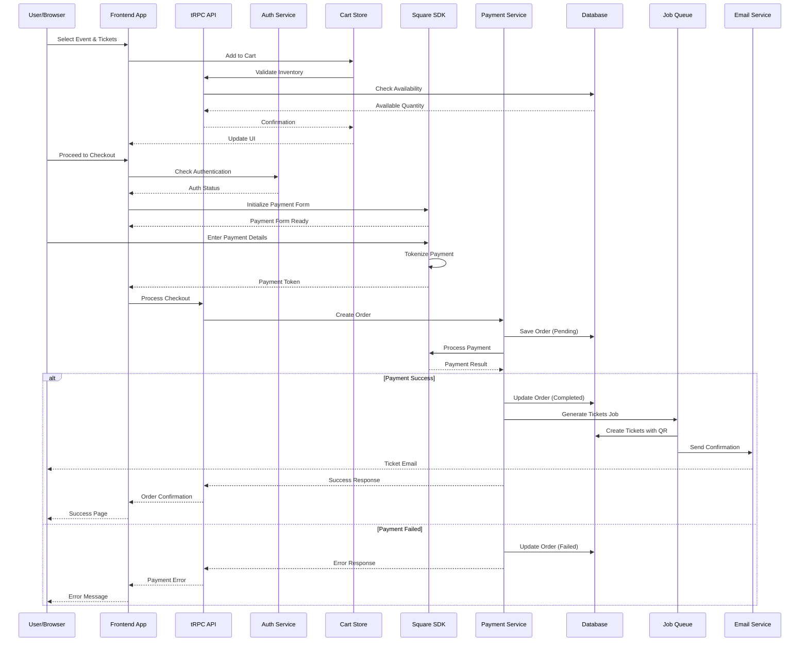
```mermaid
sequenceDiagram
    participant User as User/Browser
    participant FE as Frontend App
    participant API as tRPC API
    participant Auth as Auth Service
    participant Cart as Cart Store
    participant Square as Square SDK
    participant Payment as Payment Service
    participant DB as Database
    participant Queue as Job Queue
    participant Email as Email Service

    User->>FE: Select Event & Tickets
    FE->>Cart: Add to Cart
    Cart->>API: Validate Inventory
    API->>DB: Check Availability
    DB-->>API: Available Quantity
    API-->>Cart: Confirmation
    Cart-->>FE: Update UI

    User->>FE: Proceed to Checkout
    FE->>Auth: Check Authentication
    Auth-->>FE: Auth Status

    FE->>Square: Initialize Payment Form
    Square-->>FE: Payment Form Ready

    User->>Square: Enter Payment Details
    Square->>Square: Tokenize Payment
    Square-->>FE: Payment Token

    FE->>API: Process Checkout
    API->>Payment: Create Order
    Payment->>DB: Save Order (Pending)
    Payment->>Square: Process Payment
    Square-->>Payment: Payment Result

    alt Payment Success
        Payment->>DB: Update Order (Completed)
        Payment->>Queue: Generate Tickets Job
        Queue->>DB: Create Tickets with QR
        Queue->>Email: Send Confirmation
        Email-->>User: Ticket Email
        Payment-->>API: Success Response
        API-->>FE: Order Confirmation
        FE-->>User: Success Page
    else Payment Failed
        Payment->>DB: Update Order (Failed)
        Payment-->>API: Error Response
        API-->>FE: Payment Error
        FE-->>User: Error Message
    end
```

### Real-time Seat Selection Flow

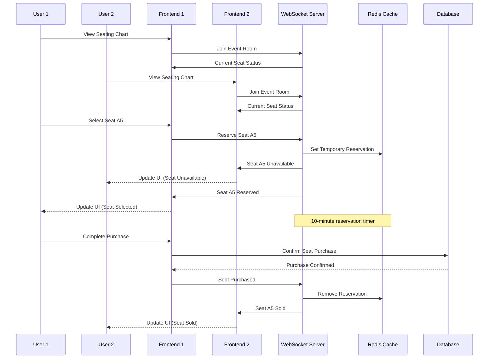
```mermaid
sequenceDiagram
    participant User1 as User 1
    participant User2 as User 2
    participant FE1 as Frontend 1
    participant FE2 as Frontend 2
    participant WS as WebSocket Server
    participant Redis as Redis Cache
    participant DB as Database

    User1->>FE1: View Seating Chart
    FE1->>WS: Join Event Room
    WS->>FE1: Current Seat Status

    User2->>FE2: View Seating Chart
    FE2->>WS: Join Event Room
    WS->>FE2: Current Seat Status

    User1->>FE1: Select Seat A5
    FE1->>WS: Reserve Seat A5
    WS->>Redis: Set Temporary Reservation
    WS->>FE2: Seat A5 Unavailable
    FE2-->>User2: Update UI (Seat Unavailable)
    WS->>FE1: Seat A5 Reserved
    FE1-->>User1: Update UI (Seat Selected)

    Note over WS,Redis: 10-minute reservation timer

    User1->>FE1: Complete Purchase
    FE1->>DB: Confirm Seat Purchase
    DB-->>FE1: Purchase Confirmed
    FE1->>WS: Seat Purchased
    WS->>Redis: Remove Reservation
    WS->>FE2: Seat A5 Sold
    FE2-->>User2: Update UI (Seat Sold)
```

### Event Creation & Management Flow

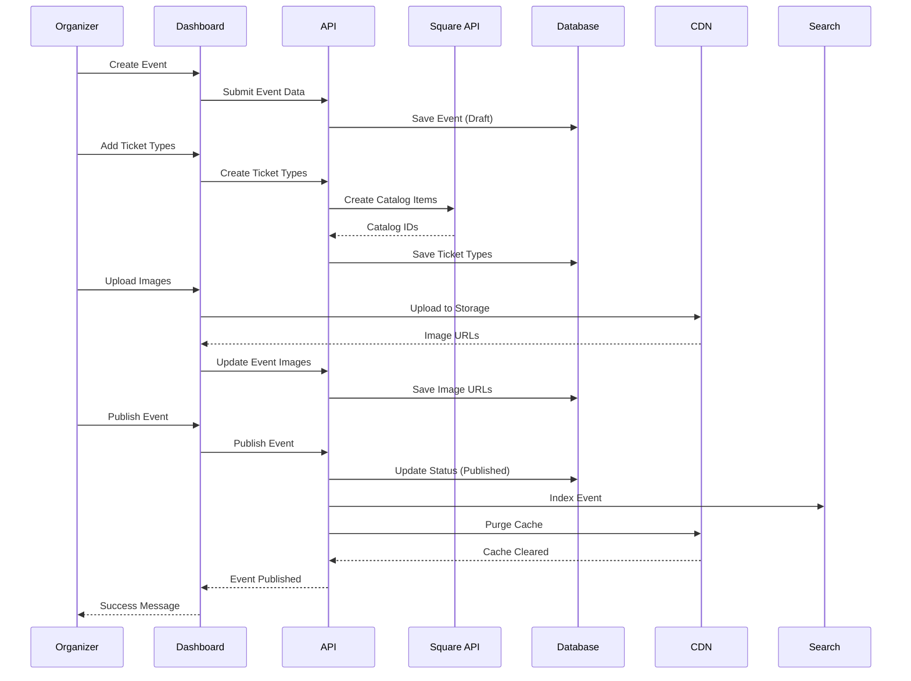
```mermaid
sequenceDiagram
    participant Organizer
    participant Dashboard
    participant API
    participant Square as Square API
    participant DB as Database
    participant CDN
    participant Search

    Organizer->>Dashboard: Create Event
    Dashboard->>API: Submit Event Data
    API->>DB: Save Event (Draft)

    Organizer->>Dashboard: Add Ticket Types
    Dashboard->>API: Create Ticket Types
    API->>Square: Create Catalog Items
    Square-->>API: Catalog IDs
    API->>DB: Save Ticket Types

    Organizer->>Dashboard: Upload Images
    Dashboard->>CDN: Upload to Storage
    CDN-->>Dashboard: Image URLs
    Dashboard->>API: Update Event Images
    API->>DB: Save Image URLs

    Organizer->>Dashboard: Publish Event
    Dashboard->>API: Publish Event
    API->>DB: Update Status (Published)
    API->>Search: Index Event
    API->>CDN: Purge Cache
    CDN-->>API: Cache Cleared
    API-->>Dashboard: Event Published
    Dashboard-->>Organizer: Success Message
```

---

## Database Architecture Diagrams

### Entity Relationship Model

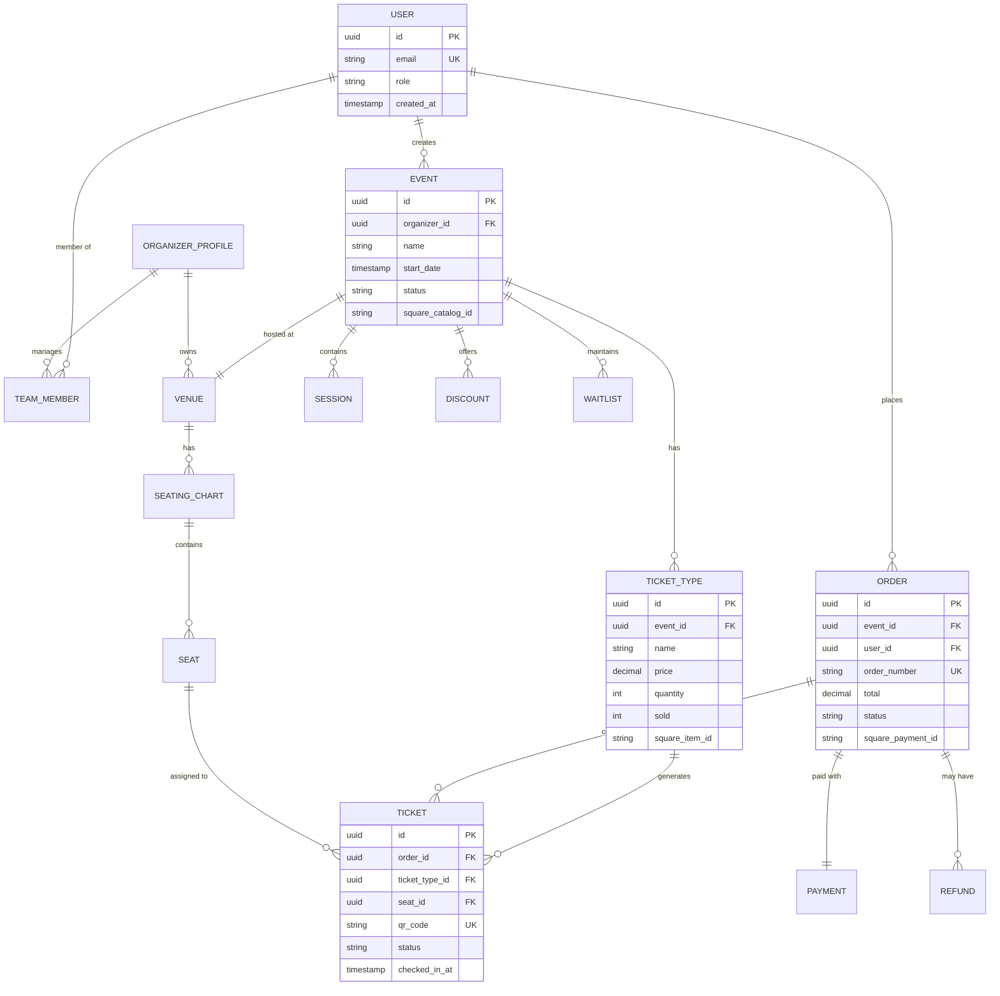
```mermaid
erDiagram
    USER ||--o{ EVENT : creates
    USER ||--o{ ORDER : places
    USER ||--o{ TEAM_MEMBER : "member of"

    EVENT ||--o{ TICKET_TYPE : has
    EVENT ||--|| VENUE : "hosted at"
    EVENT ||--o{ SESSION : contains
    EVENT ||--o{ DISCOUNT : offers
    EVENT ||--o{ WAITLIST : maintains

    TICKET_TYPE ||--o{ TICKET : generates

    ORDER ||--o{ TICKET : contains
    ORDER ||--|| PAYMENT : "paid with"
    ORDER ||--o{ REFUND : "may have"

    VENUE ||--o{ SEATING_CHART : has
    SEATING_CHART ||--o{ SEAT : contains
    SEAT ||--o{ TICKET : "assigned to"

    ORGANIZER_PROFILE ||--o{ TEAM_MEMBER : manages
    ORGANIZER_PROFILE ||--o{ VENUE : owns

    USER {
        uuid id PK
        string email UK
        string role
        timestamp created_at
    }

    EVENT {
        uuid id PK
        uuid organizer_id FK
        string name
        timestamp start_date
        string status
        string square_catalog_id
    }

    TICKET_TYPE {
        uuid id PK
        uuid event_id FK
        string name
        decimal price
        int quantity
        int sold
        string square_item_id
    }

    ORDER {
        uuid id PK
        uuid event_id FK
        uuid user_id FK
        string order_number UK
        decimal total
        string status
        string square_payment_id
    }

    TICKET {
        uuid id PK
        uuid order_id FK
        uuid ticket_type_id FK
        uuid seat_id FK
        string qr_code UK
        string status
        timestamp checked_in_at
    }
```

### Database Sharding Strategy (Future Scale)

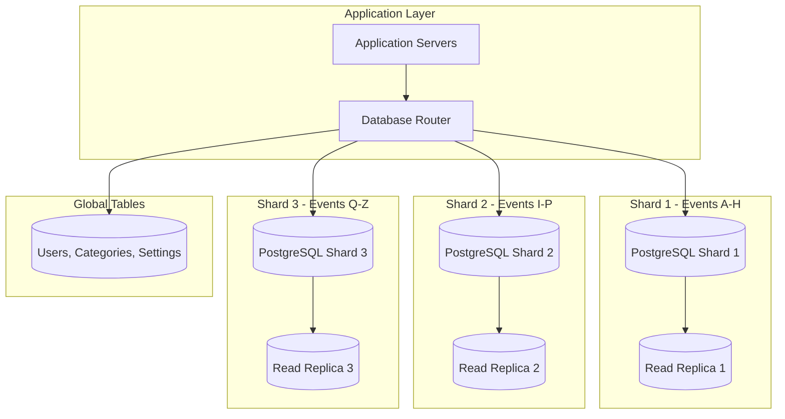
```mermaid
graph TB
    subgraph "Application Layer"
        APP[Application Servers]
        ROUTER[Database Router]
    end

    subgraph "Shard 1 - Events A-H"
        SHARD1[(PostgreSQL Shard 1)]
        REPLICA1[(Read Replica 1)]
    end

    subgraph "Shard 2 - Events I-P"
        SHARD2[(PostgreSQL Shard 2)]
        REPLICA2[(Read Replica 2)]
    end

    subgraph "Shard 3 - Events Q-Z"
        SHARD3[(PostgreSQL Shard 3)]
        REPLICA3[(Read Replica 3)]
    end

    subgraph "Global Tables"
        GLOBAL[(Users, Categories, Settings)]
    end

    APP --> ROUTER
    ROUTER --> SHARD1
    ROUTER --> SHARD2
    ROUTER --> SHARD3
    ROUTER --> GLOBAL

    SHARD1 --> REPLICA1
    SHARD2 --> REPLICA2
    SHARD3 --> REPLICA3
```

---

## Security Architecture Diagrams

### Authentication & Authorization Flow

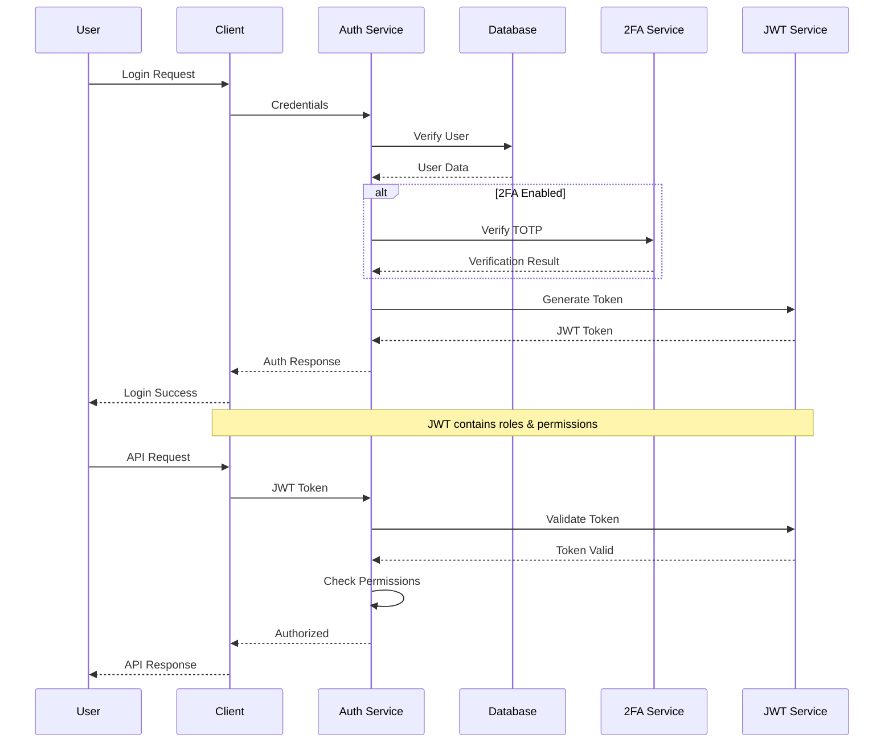
```mermaid
sequenceDiagram
    participant User
    participant Client
    participant Auth as Auth Service
    participant DB as Database
    participant MFA as 2FA Service
    participant JWT as JWT Service

    User->>Client: Login Request
    Client->>Auth: Credentials
    Auth->>DB: Verify User
    DB-->>Auth: User Data

    alt 2FA Enabled
        Auth->>MFA: Verify TOTP
        MFA-->>Auth: Verification Result
    end

    Auth->>JWT: Generate Token
    JWT-->>Auth: JWT Token
    Auth-->>Client: Auth Response
    Client-->>User: Login Success

    Note over Client,JWT: JWT contains roles & permissions

    User->>Client: API Request
    Client->>Auth: JWT Token
    Auth->>JWT: Validate Token
    JWT-->>Auth: Token Valid
    Auth->>Auth: Check Permissions
    Auth-->>Client: Authorized
    Client-->>User: API Response
```

### Data Protection Architecture

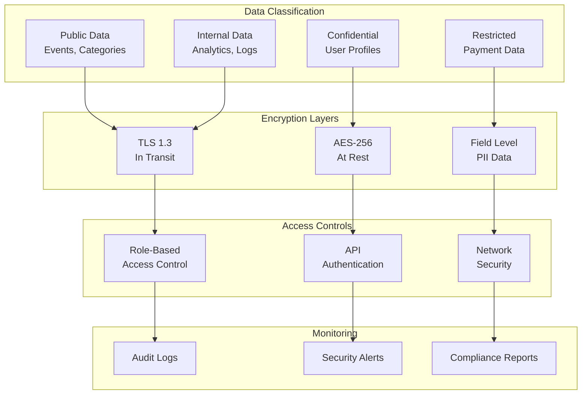
```mermaid
graph TB
    subgraph "Data Classification"
        PUBLIC[Public Data<br/>Events, Categories]
        INTERNAL[Internal Data<br/>Analytics, Logs]
        CONFIDENTIAL[Confidential<br/>User Profiles]
        RESTRICTED[Restricted<br/>Payment Data]
    end

    subgraph "Encryption Layers"
        TRANSIT[TLS 1.3<br/>In Transit]
        REST[AES-256<br/>At Rest]
        FIELD[Field Level<br/>PII Data]
    end

    subgraph "Access Controls"
        RBAC[Role-Based<br/>Access Control]
        API_AUTH[API<br/>Authentication]
        NETWORK[Network<br/>Security]
    end

    subgraph "Monitoring"
        AUDIT[Audit Logs]
        ALERTS[Security Alerts]
        COMPLIANCE[Compliance Reports]
    end

    PUBLIC --> TRANSIT
    INTERNAL --> TRANSIT
    CONFIDENTIAL --> REST
    RESTRICTED --> FIELD

    TRANSIT --> RBAC
    REST --> API_AUTH
    FIELD --> NETWORK

    RBAC --> AUDIT
    API_AUTH --> ALERTS
    NETWORK --> COMPLIANCE
```

---

## Performance & Scalability Architecture

### Caching Layer Diagram

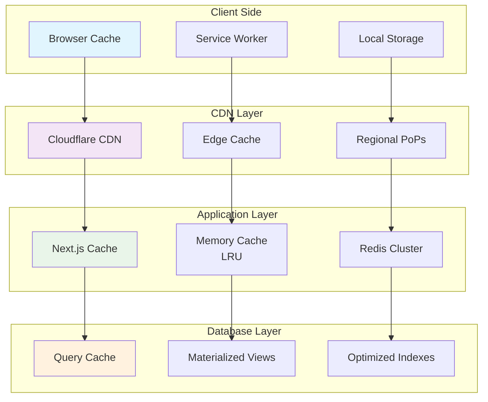
```mermaid
graph TB
    subgraph "Client Side"
        BROWSER[Browser Cache]
        SERVICE_WORKER[Service Worker]
        LOCAL_STORAGE[Local Storage]
    end

    subgraph "CDN Layer"
        CLOUDFLARE[Cloudflare CDN]
        EDGE_CACHE[Edge Cache]
        REGIONAL[Regional PoPs]
    end

    subgraph "Application Layer"
        NEXT_CACHE[Next.js Cache]
        MEMORY[Memory Cache<br/>LRU]
        REDIS_CLUSTER[Redis Cluster]
    end

    subgraph "Database Layer"
        QUERY_CACHE[Query Cache]
        MATERIALIZED[Materialized Views]
        INDEXES[Optimized Indexes]
    end

    BROWSER --> CLOUDFLARE
    SERVICE_WORKER --> EDGE_CACHE
    LOCAL_STORAGE --> REGIONAL

    CLOUDFLARE --> NEXT_CACHE
    EDGE_CACHE --> MEMORY
    REGIONAL --> REDIS_CLUSTER

    NEXT_CACHE --> QUERY_CACHE
    MEMORY --> MATERIALIZED
    REDIS_CLUSTER --> INDEXES

    style BROWSER fill:#e1f5fe
    style CLOUDFLARE fill:#f3e5f5
    style NEXT_CACHE fill:#e8f5e8
    style QUERY_CACHE fill:#fff3e0
```

### Load Balancing & Scaling Strategy

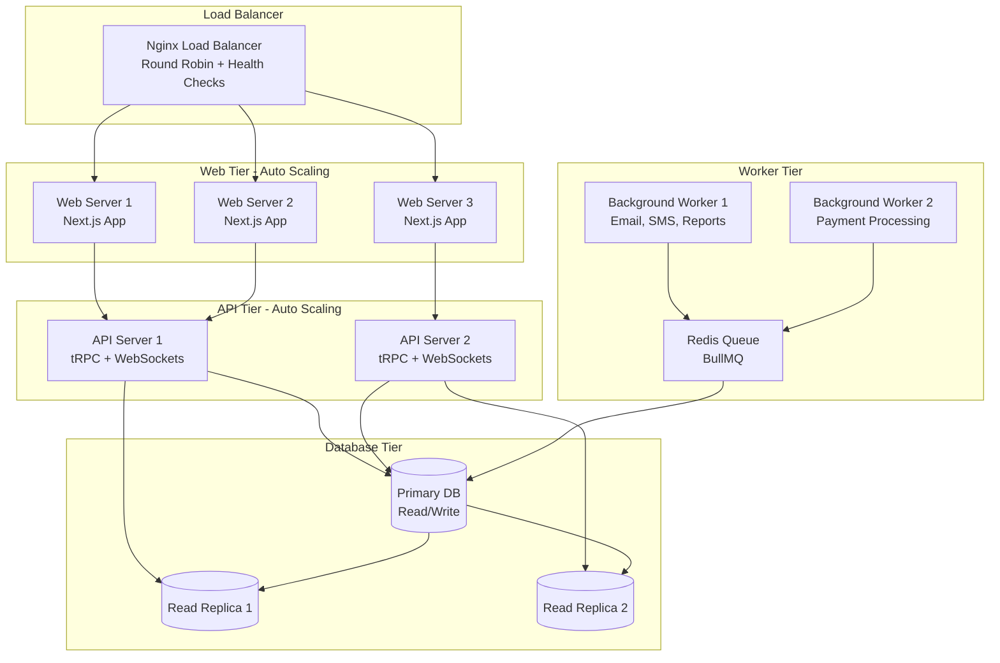
```mermaid
graph TB
    subgraph "Load Balancer"
        LB[Nginx Load Balancer<br/>Round Robin + Health Checks]
    end

    subgraph "Web Tier - Auto Scaling"
        WEB1[Web Server 1<br/>Next.js App]
        WEB2[Web Server 2<br/>Next.js App]
        WEB3[Web Server 3<br/>Next.js App]
    end

    subgraph "API Tier - Auto Scaling"
        API1[API Server 1<br/>tRPC + WebSockets]
        API2[API Server 2<br/>tRPC + WebSockets]
    end

    subgraph "Worker Tier"
        WORKER1[Background Worker 1<br/>Email, SMS, Reports]
        WORKER2[Background Worker 2<br/>Payment Processing]
        QUEUE[Redis Queue<br/>BullMQ]
    end

    subgraph "Database Tier"
        PRIMARY[(Primary DB<br/>Read/Write)]
        REPLICA1[(Read Replica 1)]
        REPLICA2[(Read Replica 2)]
    end

    LB --> WEB1
    LB --> WEB2
    LB --> WEB3

    WEB1 --> API1
    WEB2 --> API1
    WEB3 --> API2

    API1 --> PRIMARY
    API2 --> PRIMARY
    API1 --> REPLICA1
    API2 --> REPLICA2

    WORKER1 --> QUEUE
    WORKER2 --> QUEUE
    QUEUE --> PRIMARY

    PRIMARY --> REPLICA1
    PRIMARY --> REPLICA2
```

---

## Deployment Architecture

### Production Infrastructure Diagram

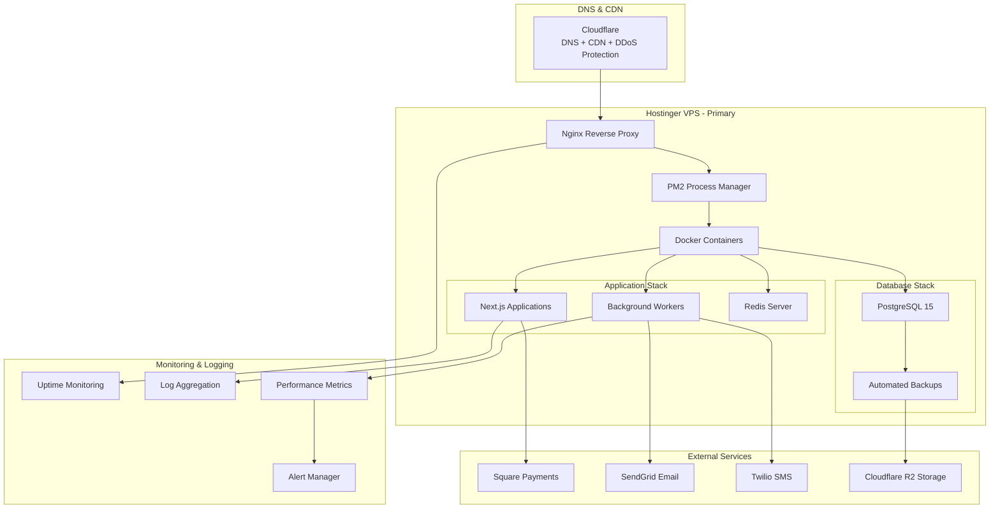
```mermaid
graph TB
    subgraph "DNS & CDN"
        CLOUDFLARE[Cloudflare<br/>DNS + CDN + DDoS Protection]
    end

    subgraph "Hostinger VPS - Primary"
        NGINX[Nginx Reverse Proxy]
        PM2[PM2 Process Manager]
        DOCKER[Docker Containers]

        subgraph "Application Stack"
            NEXT[Next.js Applications]
            WORKERS[Background Workers]
            REDIS[Redis Server]
        end

        subgraph "Database Stack"
            POSTGRES[PostgreSQL 15]
            BACKUP[Automated Backups]
        end
    end

    subgraph "Monitoring & Logging"
        UPTIME[Uptime Monitoring]
        LOGS[Log Aggregation]
        METRICS[Performance Metrics]
        ALERTS[Alert Manager]
    end

    subgraph "External Services"
        SQUARE[Square Payments]
        SENDGRID[SendGrid Email]
        TWILIO[Twilio SMS]
        R2[Cloudflare R2 Storage]
    end

    CLOUDFLARE --> NGINX
    NGINX --> PM2
    PM2 --> DOCKER
    DOCKER --> NEXT
    DOCKER --> WORKERS
    DOCKER --> REDIS
    DOCKER --> POSTGRES

    POSTGRES --> BACKUP
    BACKUP --> R2

    NEXT --> SQUARE
    WORKERS --> SENDGRID
    WORKERS --> TWILIO

    NGINX --> UPTIME
    NEXT --> LOGS
    WORKERS --> METRICS
    METRICS --> ALERTS
```

### CI/CD Pipeline Architecture

```mermaid
graph LR
    subgraph "Development"
        DEV[Developer]
        GIT[Git Repository]
        BRANCH[Feature Branch]
    end

    subgraph "CI Pipeline"
        TRIGGER[GitHub Actions]
        TEST[Automated Tests]
        BUILD[Build Application]
        SECURITY[Security Scan]
    end

    subgraph "Staging"
        STAGING[Staging Environment]
        E2E[E2E Tests]
        APPROVAL[Manual Approval]
    end

    subgraph "Production"
        DEPLOY[Production Deploy]
        SMOKE[Smoke Tests]
        MONITOR[Monitoring]
    end

    DEV --> GIT
    GIT --> BRANCH
    BRANCH --> TRIGGER
    TRIGGER --> TEST
    TEST --> BUILD
    BUILD --> SECURITY
    SECURITY --> STAGING
    STAGING --> E2E
    E2E --> APPROVAL
    APPROVAL --> DEPLOY
    DEPLOY --> SMOKE
    SMOKE --> MONITOR
```

---

## Real-time Communication Architecture

### WebSocket Connection Management

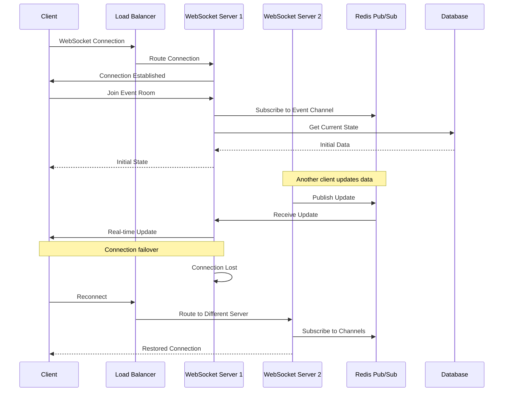
```mermaid
sequenceDiagram
    participant Client
    participant LB as Load Balancer
    participant WS1 as WebSocket Server 1
    participant WS2 as WebSocket Server 2
    participant Redis as Redis Pub/Sub
    participant DB as Database

    Client->>LB: WebSocket Connection
    LB->>WS1: Route Connection
    WS1->>Client: Connection Established

    Client->>WS1: Join Event Room
    WS1->>Redis: Subscribe to Event Channel
    WS1->>DB: Get Current State
    DB-->>WS1: Initial Data
    WS1-->>Client: Initial State

    Note over WS2,Redis: Another client updates data
    WS2->>Redis: Publish Update
    Redis->>WS1: Receive Update
    WS1->>Client: Real-time Update

    Note over Client,WS1: Connection failover
    WS1->>WS1: Connection Lost
    Client->>LB: Reconnect
    LB->>WS2: Route to Different Server
    WS2->>Redis: Subscribe to Channels
    WS2-->>Client: Restored Connection
```

### Event-Driven Architecture

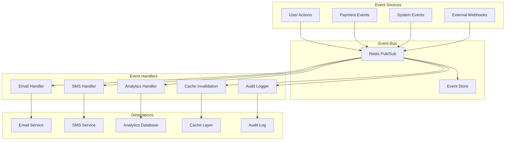
```mermaid
graph TB
    subgraph "Event Sources"
        USER_ACTION[User Actions]
        PAYMENT[Payment Events]
        SYSTEM[System Events]
        WEBHOOK[External Webhooks]
    end

    subgraph "Event Bus"
        REDIS_PUBSUB[Redis Pub/Sub]
        EVENT_STORE[Event Store]
    end

    subgraph "Event Handlers"
        EMAIL_HANDLER[Email Handler]
        SMS_HANDLER[SMS Handler]
        ANALYTICS[Analytics Handler]
        CACHE_INVALIDATION[Cache Invalidation]
        AUDIT[Audit Logger]
    end

    subgraph "Destinations"
        EMAIL_SERVICE[Email Service]
        SMS_SERVICE[SMS Service]
        ANALYTICS_DB[Analytics Database]
        CACHE_LAYER[Cache Layer]
        AUDIT_LOG[Audit Log]
    end

    USER_ACTION --> REDIS_PUBSUB
    PAYMENT --> REDIS_PUBSUB
    SYSTEM --> REDIS_PUBSUB
    WEBHOOK --> REDIS_PUBSUB

    REDIS_PUBSUB --> EVENT_STORE
    REDIS_PUBSUB --> EMAIL_HANDLER
    REDIS_PUBSUB --> SMS_HANDLER
    REDIS_PUBSUB --> ANALYTICS
    REDIS_PUBSUB --> CACHE_INVALIDATION
    REDIS_PUBSUB --> AUDIT

    EMAIL_HANDLER --> EMAIL_SERVICE
    SMS_HANDLER --> SMS_SERVICE
    ANALYTICS --> ANALYTICS_DB
    CACHE_INVALIDATION --> CACHE_LAYER
    AUDIT --> AUDIT_LOG
```

---

## Integration Architecture

### Third-Party Service Integration

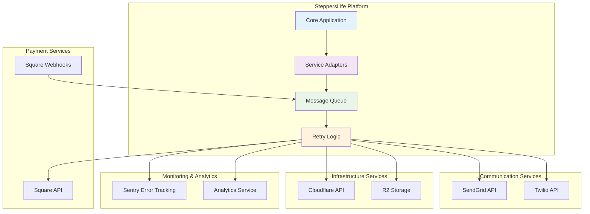
```mermaid
graph TB
    subgraph "SteppersLife Platform"
        CORE[Core Application]
        ADAPTER[Service Adapters]
        QUEUE[Message Queue]
        RETRY[Retry Logic]
    end

    subgraph "Payment Services"
        SQUARE[Square API]
        WEBHOOK_SQUARE[Square Webhooks]
    end

    subgraph "Communication Services"
        SENDGRID[SendGrid API]
        TWILIO[Twilio API]
    end

    subgraph "Infrastructure Services"
        CLOUDFLARE_API[Cloudflare API]
        STORAGE[R2 Storage]
    end

    subgraph "Monitoring & Analytics"
        SENTRY[Sentry Error Tracking]
        ANALYTICS[Analytics Service]
    end

    CORE --> ADAPTER
    ADAPTER --> QUEUE
    QUEUE --> RETRY

    RETRY --> SQUARE
    RETRY --> SENDGRID
    RETRY --> TWILIO
    RETRY --> CLOUDFLARE_API
    RETRY --> STORAGE
    RETRY --> SENTRY
    RETRY --> ANALYTICS

    WEBHOOK_SQUARE --> QUEUE

    style CORE fill:#e3f2fd
    style ADAPTER fill:#f3e5f5
    style QUEUE fill:#e8f5e8
    style RETRY fill:#fff3e0
```

This comprehensive system architecture documentation provides clear visualization of:

1. **High-level system overview** with all components and connections
2. **Application layer structure** showing internal organization
3. **Data flow models** for critical business processes
4. **Database architecture** with relationships and scaling strategies
5. **Security architecture** with authentication and protection layers
6. **Performance architecture** with caching and scaling strategies
7. **Deployment architecture** with infrastructure and CI/CD
8. **Real-time communication** with WebSocket management
9. **Integration architecture** with third-party services

These diagrams serve as the definitive reference for understanding the complete system design and can guide development, deployment, and maintenance activities.