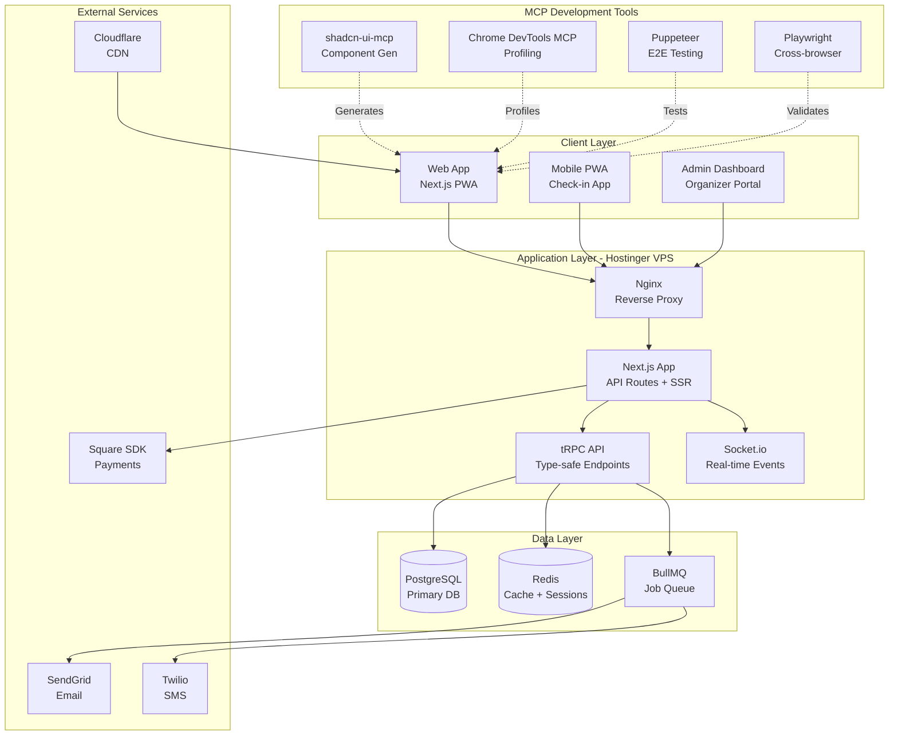
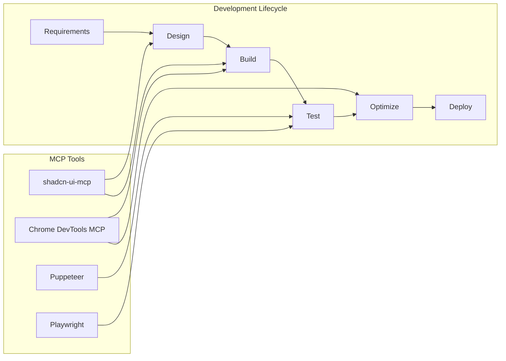
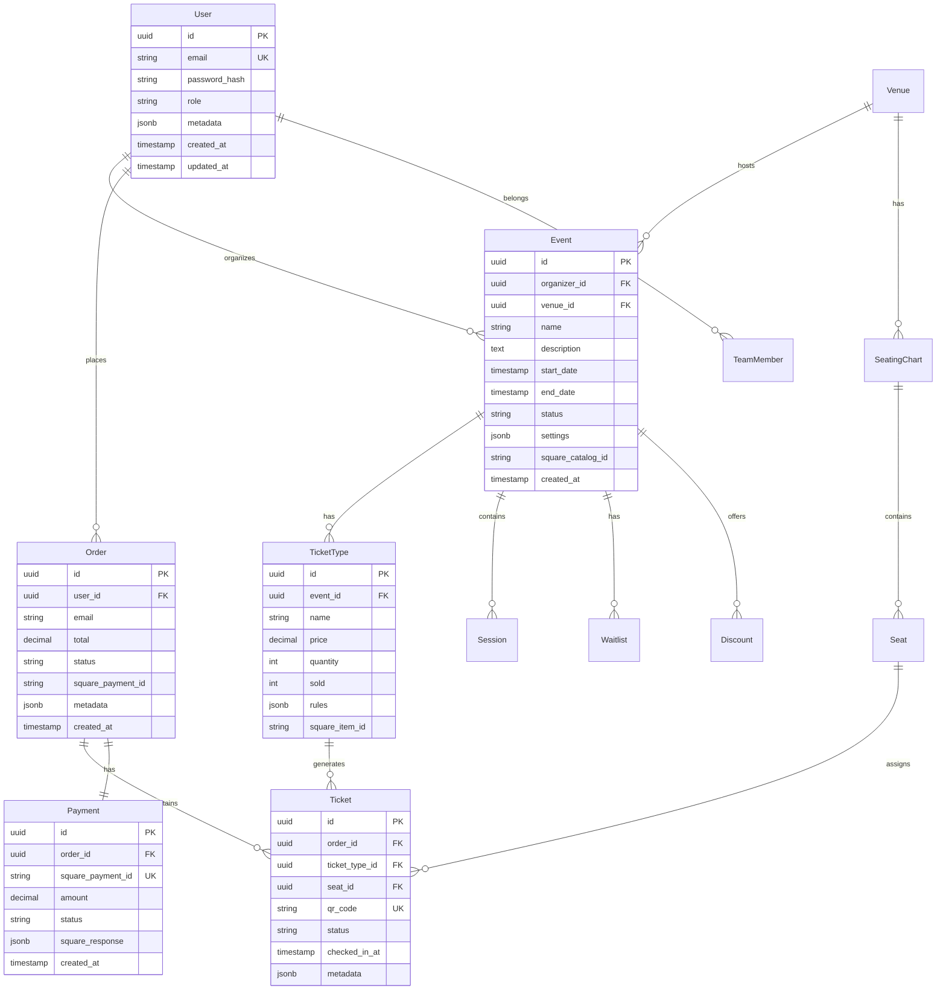
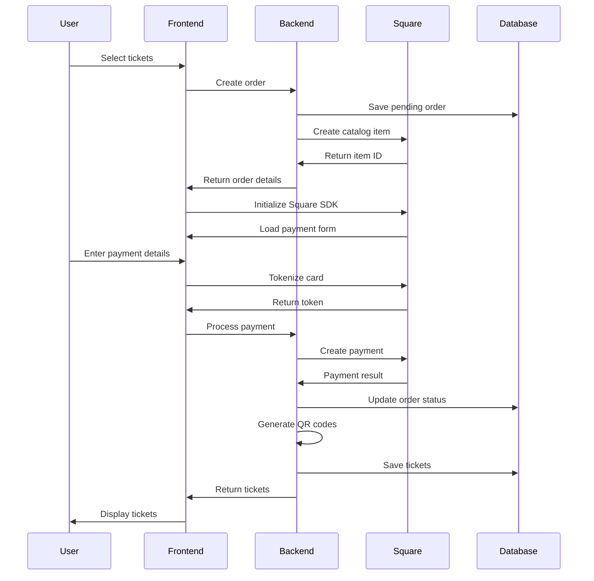

# SteppersLife Events and Tickets System
## Full-Stack Architecture Document
### Version 1.0

---

## Executive Summary

This architecture document defines the complete technical implementation for SteppersLife, a US-focused event ticketing platform. The architecture leverages MCP (Model Context Protocol) tools for AI-assisted development, ensuring rapid, high-quality implementation with comprehensive testing coverage. The system is designed for initial deployment on Hostinger VPS with vertical scaling capabilities, using Square as the sole payment processor.

---

## Table of Contents

1. [System Overview](#system-overview)
2. [Architecture Principles](#architecture-principles)
3. [Technology Stack](#technology-stack)
4. [System Architecture](#system-architecture)
5. [MCP-Driven Development Architecture](#mcp-driven-development-architecture)
6. [Database Architecture](#database-architecture)
7. [API Architecture](#api-architecture)
8. [Frontend Architecture](#frontend-architecture)
9. [Payment Processing Architecture](#payment-processing-architecture)
10. [Real-time Systems Architecture](#real-time-systems-architecture)
11. [Testing Architecture](#testing-architecture)
12. [Security Architecture](#security-architecture)
13. [Infrastructure & Deployment](#infrastructure--deployment)
14. [Performance Architecture](#performance-architecture)
15. [Monitoring & Observability](#monitoring--observability)
16. [Disaster Recovery](#disaster-recovery)

---

## System Overview

### High-Level Architecture



### Architecture Style

**Modular Monolith** with clear separation of concerns, designed to be broken into microservices if needed:

- **Presentation Layer**: Next.js App Router with React Server Components
- **API Layer**: tRPC for type-safe API with WebSocket support via Socket.io
- **Business Logic Layer**: Domain-driven design with use cases and entities
- **Data Access Layer**: Prisma ORM with PostgreSQL
- **Infrastructure Layer**: Cross-cutting concerns (auth, logging, caching)

---

## Architecture Principles

### Core Principles

1. **MCP-First Development**: Leverage AI tools at every stage
2. **Type Safety End-to-End**: TypeScript + tRPC + Prisma
3. **Progressive Enhancement**: Core features work without JavaScript
4. **Offline-First**: Critical features work offline (check-in app)
5. **Security by Design**: Defense in depth, zero trust architecture
6. **Performance Budget**: <1.5s page load, <200ms API response
7. **Accessibility First**: WCAG 2.1 AA compliance from day one
8. **Cost Optimization**: Efficient resource usage on VPS

### Design Patterns

- **Repository Pattern**: Abstract data access logic
- **Use Case Pattern**: Business logic in discrete use cases
- **Factory Pattern**: Component and entity creation
- **Observer Pattern**: Event-driven updates via WebSockets
- **Strategy Pattern**: Payment processor abstraction
- **Singleton Pattern**: Database and cache connections
- **Facade Pattern**: Simplified interfaces for complex subsystems

---

## Technology Stack

### Complete Stack with Versions

```yaml
# Core Framework
Runtime: Node.js 20.11 LTS
Framework: Next.js 14.2.0
Language: TypeScript 5.3

# UI/UX Layer
Component Library: shadcn/ui latest
CSS Framework: Tailwind CSS 4.0
Color System: OKLCH native support
Icons: Lucide React 0.300+
Animation: Framer Motion 11.0

# MCP Development Tools (MANDATORY)
Component Generation: shadcn-ui-mcp-server latest
Performance Profiling: chrome-devtools-mcp latest
E2E Testing Primary: Puppeteer 22.0
Cross-browser Testing: Playwright 1.41

# State Management
Client State: Zustand 4.5
Server State: TanStack Query 5.0
Form State: React Hook Form 7.48
Form Validation: Zod 3.22

# API Layer
API Framework: tRPC 10.45
WebSockets: Socket.io 4.7
API Documentation: tRPC-OpenAPI 1.2

# Database & ORM
Database: PostgreSQL 15.5
ORM: Prisma 5.8
Migrations: Prisma Migrate
Query Builder: Prisma Client

# Caching & Sessions
Cache: Redis 7.2
Session Store: connect-redis 7.1
Rate Limiting: rate-limiter-flexible 3.0

# Background Jobs
Queue: BullMQ 5.1
Scheduler: node-cron 3.0

# Payment Processing
Payment SDK: Square Web SDK 2.0
Payment Types: Square + Cash App Pay

# Authentication
Auth Library: NextAuth.js 4.24
JWT: jsonwebtoken 9.0
Encryption: bcrypt 5.1

# File Handling
Image Processing: Sharp 0.33
QR Codes: qrcode 1.5
PDF Generation: React PDF 3.1

# Email & SMS
Email Service: SendGrid Node.js SDK 8.0
SMS Service: Twilio Node.js SDK 4.0

# Monitoring & Logging
Logger: Winston 3.11
APM: Sentry Node 7.0
Uptime: Uptime Kuma 1.23

# Development Tools
Package Manager: pnpm 8.14
Bundler: Turbopack (Next.js built-in)
Linter: ESLint 8.56
Formatter: Prettier 3.2
Git Hooks: Husky 8.0 + lint-staged 15.0

# Testing Suite
Unit Testing: Vitest 1.2
Component Testing: React Testing Library 14.0
E2E Testing: Puppeteer 22.0 + Playwright 1.41
API Testing: Supertest 6.3
Load Testing: k6 0.48

# Infrastructure
Web Server: Nginx 1.25
Process Manager: PM2 5.3
SSL: Let's Encrypt via Certbot
CDN: Cloudflare (free tier)
```

---

## System Architecture

### Component Architecture

```typescript
// Domain-Driven Design Structure
src/
├── app/                    # Next.js App Router
│   ├── (public)/          # Public routes
│   │   ├── events/
│   │   ├── checkout/
│   │   └── tickets/
│   ├── (organizer)/       # Organizer dashboard
│   │   ├── dashboard/
│   │   ├── events/
│   │   └── reports/
│   ├── (admin)/           # Admin panel
│   │   └── settings/
│   └── api/               # API routes
│       ├── trpc/
│       └── webhooks/
│
├── components/            # UI Components (MCP-generated)
│   ├── ui/               # shadcn/ui components
│   │   ├── button.tsx    # OKLCH-themed
│   │   ├── card.tsx
│   │   └── form.tsx
│   ├── events/
│   ├── checkout/
│   └── dashboard/
│
├── lib/                   # Business Logic
│   ├── domain/           # Domain entities
│   │   ├── event/
│   │   ├── ticket/
│   │   ├── user/
│   │   └── payment/
│   ├── use-cases/        # Business use cases
│   │   ├── create-event/
│   │   ├── purchase-ticket/
│   │   └── check-in/
│   ├── repositories/     # Data access
│   │   ├── event.repository.ts
│   │   └── ticket.repository.ts
│   └── services/         # External services
│       ├── square.service.ts
│       ├── email.service.ts
│       └── qr.service.ts
│
├── infrastructure/        # Cross-cutting concerns
│   ├── auth/
│   ├── cache/
│   ├── database/
│   ├── monitoring/
│   └── queue/
│
├── tests/                # MCP-driven testing
│   ├── unit/            # Vitest
│   ├── integration/     # Supertest
│   ├── e2e/            
│   │   ├── puppeteer/  # Chrome-specific
│   │   └── playwright/ # Cross-browser
│   └── performance/    # k6 load tests
│
└── mcp-config/          # MCP tool configurations
    ├── shadcn-ui-mcp.config.js
    ├── chrome-devtools.config.js
    ├── puppeteer.config.js
    └── playwright.config.js
```

### Layered Architecture Details

```typescript
// 1. Presentation Layer (UI Components via shadcn-ui-mcp)
interface EventCardProps {
  event: Event;
  variant?: 'default' | 'featured';
  className?: string;
}

// MCP-generated component with OKLCH theme
export const EventCard = ({ event, variant = 'default' }: EventCardProps) => {
  return (
    <Card className={cn(
      "border-border bg-card text-card-foreground",
      "shadow-md hover:shadow-lg transition-shadow",
      "rounded-[var(--radius)]", // 1.3rem from theme
      variant === 'featured' && "border-primary"
    )}>
      {/* Component implementation */}
    </Card>
  );
};

// 2. API Layer (tRPC)
export const eventRouter = router({
  create: protectedProcedure
    .input(createEventSchema)
    .mutation(async ({ input, ctx }) => {
      return await createEventUseCase.execute(input, ctx.user);
    }),
    
  list: publicProcedure
    .input(listEventsSchema)
    .query(async ({ input }) => {
      return await listEventsUseCase.execute(input);
    }),
    
  // Real-time subscription
  onSeatUpdate: publicProcedure
    .input(z.object({ eventId: z.string() }))
    .subscription(({ input }) => {
      return observable<SeatUpdate>((emit) => {
        const onUpdate = (data: SeatUpdate) => emit.next(data);
        ee.on(`seat-update-${input.eventId}`, onUpdate);
        return () => ee.off(`seat-update-${input.eventId}`, onUpdate);
      });
    }),
});

// 3. Business Logic Layer
export class CreateEventUseCase {
  constructor(
    private eventRepo: EventRepository,
    private squareService: SquareService,
    private emailService: EmailService
  ) {}
  
  async execute(input: CreateEventInput, organizer: User): Promise<Event> {
    // Validate business rules
    if (input.capacity > 5000) {
      throw new BusinessError("MVP limitation: Maximum 5000 seats");
    }
    
    // Create event entity
    const event = Event.create({
      ...input,
      organizerId: organizer.id,
      status: 'draft'
    });
    
    // Set up Square catalog item
    if (event.hasPayment) {
      const catalogItem = await this.squareService.createCatalogItem(event);
      event.setSquareCatalogId(catalogItem.id);
    }
    
    // Persist event
    const savedEvent = await this.eventRepo.save(event);
    
    // Send confirmation email
    await this.emailService.sendEventCreated(organizer, savedEvent);
    
    return savedEvent;
  }
}

// 4. Data Access Layer
export class EventRepository {
  constructor(private prisma: PrismaClient) {}
  
  async save(event: Event): Promise<Event> {
    const data = event.toPersistence();
    const saved = await this.prisma.event.create({ data });
    return Event.fromPersistence(saved);
  }
  
  async findById(id: string): Promise<Event | null> {
    const data = await this.prisma.event.findUnique({
      where: { id },
      include: {
        tickets: true,
        organizer: true
      }
    });
    return data ? Event.fromPersistence(data) : null;
  }
}
```

---

## MCP-Driven Development Architecture

### MCP Tool Integration Points



### shadcn-ui-mcp-server Workflow

```javascript
// mcp-config/shadcn-ui-mcp.config.js
module.exports = {
  theme: {
    cssVariables: true,
    colors: {
      // OKLCH color configuration
      primary: "oklch(0.6723 0.1606 244.9955)",
      primaryForeground: "oklch(1.0000 0 0)",
      secondary: "oklch(0.1884 0.0128 248.5103)",
      destructive: "oklch(0.6188 0.2376 25.7658)",
      border: "oklch(0.9317 0.0118 231.6594)",
      // ... rest of OKLCH theme
    },
    radius: "1.3rem",
    fontFamily: {
      sans: ["Open Sans", "sans-serif"],
      serif: ["Georgia", "serif"],
      mono: ["Menlo", "monospace"]
    }
  },
  components: {
    // Component generation templates
    patterns: {
      card: {
        base: "border bg-card text-card-foreground shadow-md",
        hover: "hover:shadow-lg transition-shadow duration-200"
      },
      button: {
        variants: ["default", "destructive", "outline", "ghost"],
        sizes: ["sm", "md", "lg", "icon"]
      }
    }
  },
  accessibility: {
    enforceAria: true,
    enforceKeyboard: true,
    contrastRatio: 4.5
  }
};

// Example: MCP-generated Event Component
// Command: shadcn-ui-mcp generate EventTicketCard --props event,onSelect --variant compact
export const EventTicketCard = forwardRef<
  HTMLDivElement,
  EventTicketCardProps
>(({ className, event, onSelect, variant = "default", ...props }, ref) => {
  const [isLoading, setIsLoading] = useState(false);
  
  return (
    <Card
      ref={ref}
      className={cn(
        "relative overflow-hidden",
        "bg-gradient-to-br from-card to-accent/5",
        "border-2 transition-all duration-200",
        "hover:border-primary hover:shadow-xl",
        "cursor-pointer select-none",
        variant === "compact" && "p-3",
        variant === "default" && "p-5",
        className
      )}
      onClick={() => !isLoading && onSelect?.(event)}
      role="button"
      tabIndex={0}
      aria-label={`Select ${event.name} ticket`}
      onKeyDown={(e) => {
        if (e.key === 'Enter' || e.key === ' ') {
          e.preventDefault();
          !isLoading && onSelect?.(event);
        }
      }}
      {...props}
    >
      {/* MCP ensures accessibility and theme compliance */}
      <CardHeader className="space-y-1 p-0">
        <CardTitle className="text-lg font-semibold">
          {event.name}
        </CardTitle>
        <CardDescription className="text-sm text-muted-foreground">
          {format(event.date, 'PPP')} at {event.venue}
        </CardDescription>
      </CardHeader>
      
      <CardContent className="p-0 mt-4">
        <div className="flex items-center justify-between">
          <span className="text-2xl font-bold text-primary">
            ${event.price}
          </span>
          {event.availableSeats < 50 && (
            <Badge variant="destructive" className="animate-pulse">
              Only {event.availableSeats} left!
            </Badge>
          )}
        </div>
      </CardContent>
    </Card>
  );
});
```

### Chrome DevTools MCP Integration

```javascript
// mcp-config/chrome-devtools.config.js
module.exports = {
  performance: {
    budget: {
      firstContentfulPaint: 1500,
      largestContentfulPaint: 2500,
      totalBlockingTime: 300,
      cumulativeLayoutShift: 0.1
    },
    monitoring: {
      enabled: true,
      realUserMonitoring: true,
      syntheticMonitoring: true
    }
  },
  accessibility: {
    audit: {
      level: 'AA',
      automated: true,
      includeManual: false
    }
  },
  security: {
    headers: {
      contentSecurityPolicy: true,
      xFrameOptions: 'DENY',
      xContentTypeOptions: 'nosniff'
    }
  },
  network: {
    throttling: {
      profiles: ['Fast 3G', '4G', 'No throttling'],
      default: '4G'
    },
    caching: {
      analyze: true,
      suggestions: true
    }
  }
};

// Usage in development
// Chrome DevTools MCP automatically profiles and suggests optimizations
// Example output:
// [Chrome DevTools MCP]: LCP can be improved by preloading hero image
// [Chrome DevTools MCP]: Reduce JavaScript bundle by 23% with code splitting
// [Chrome DevTools MCP]: Database query on /api/events taking 450ms - consider caching
```

### Puppeteer Testing Architecture

```javascript
// tests/e2e/puppeteer/ticket-purchase.test.js
import puppeteer from 'puppeteer';
import { expect } from '@jest/globals';

describe('Ticket Purchase Flow', () => {
  let browser;
  let page;
  
  beforeAll(async () => {
    browser = await puppeteer.launch({
      headless: 'new',
      args: ['--no-sandbox', '--disable-setuid-sandbox']
    });
  });
  
  afterAll(async () => {
    await browser.close();
  });
  
  beforeEach(async () => {
    page = await browser.newPage();
    await page.setViewport({ width: 1280, height: 800 });
    
    // Set up request interception for Square SDK
    await page.setRequestInterception(true);
    page.on('request', (req) => {
      if (req.url().includes('square.com')) {
        req.respond({
          status: 200,
          body: JSON.stringify({ status: 'success' })
        });
      } else {
        req.continue();
      }
    });
  });
  
  test('Complete ticket purchase with QR generation', async () => {
    // Navigate to event page
    await page.goto('http://localhost:3000/events/test-event');
    
    // Performance monitoring via Chrome DevTools MCP
    const metrics = await page.metrics();
    expect(metrics.JSHeapUsedSize).toBeLessThan(50 * 1024 * 1024); // <50MB
    
    // Select ticket
    await page.click('[data-testid="ticket-select-ga"]');
    await page.waitForSelector('[data-testid="checkout-form"]');
    
    // Fill checkout form
    await page.type('#email', 'test@example.com');
    await page.type('#name', 'John Doe');
    
    // Square payment form (mocked)
    await page.evaluate(() => {
      window.Square = {
        payments: () => ({
          card: () => ({
            attach: () => Promise.resolve(),
            tokenize: () => Promise.resolve({ token: 'test-token' })
          })
        })
      };
    });
    
    // Submit purchase
    await page.click('[data-testid="purchase-button"]');
    
    // Wait for QR code generation
    await page.waitForSelector('[data-testid="qr-code"]', { timeout: 5000 });
    
    // Verify QR code is generated
    const qrCode = await page.$eval('[data-testid="qr-code"] img', el => el.src);
    expect(qrCode).toContain('data:image/png;base64');
    
    // Test PDF download
    const [download] = await Promise.all([
      page.waitForEvent('download'),
      page.click('[data-testid="download-ticket"]')
    ]);
    
    expect(download.suggestedFilename()).toContain('ticket');
  });
  
  test('Seat selection real-time updates', async () => {
    await page.goto('http://localhost:3000/events/seated-event');
    
    // Open seat selector
    await page.click('[data-testid="select-seats"]');
    
    // Evaluate WebSocket connection
    const wsConnected = await page.evaluate(() => {
      return window.io && window.io.connected;
    });
    expect(wsConnected).toBe(true);
    
    // Select a seat
    await page.click('[data-testid="seat-A1"]');
    
    // Verify seat is marked as selected
    const seatClass = await page.$eval('[data-testid="seat-A1"]', 
      el => el.className
    );
    expect(seatClass).toContain('selected');
    
    // Simulate another user selecting a seat
    await page.evaluate(() => {
      window.io.emit('seat-selected', { seat: 'A2', userId: 'other' });
    });
    
    // Verify seat is marked as taken
    await page.waitForSelector('[data-testid="seat-A2"].taken');
  });
});
```

### Playwright Cross-Browser Testing

```javascript
// tests/e2e/playwright/cross-browser.spec.js
import { test, expect, devices } from '@playwright/test';

// Test across multiple browsers and devices
const browsers = ['chromium', 'firefox', 'webkit'];
const mobileDevices = ['iPhone 13', 'Pixel 5'];

browsers.forEach(browserName => {
  test.describe(`${browserName} Browser Tests`, () => {
    test('Event listing page renders correctly', async ({ page }) => {
      await page.goto('/events');
      
      // Check OKLCH theme variables are applied
      const primaryColor = await page.evaluate(() => {
        const computed = getComputedStyle(document.documentElement);
        return computed.getPropertyValue('--primary');
      });
      expect(primaryColor).toContain('oklch');
      
      // Verify responsive design
      const viewport = page.viewportSize();
      if (viewport.width < 640) {
        await expect(page.locator('[data-testid="mobile-menu"]')).toBeVisible();
      } else {
        await expect(page.locator('[data-testid="desktop-nav"]')).toBeVisible();
      }
    });
    
    test('Square payment integration works', async ({ page }) => {
      await page.goto('/checkout/test-event');
      
      // Wait for Square SDK to load
      await page.waitForFunction(() => window.Square);
      
      // Verify payment form is rendered
      await expect(page.locator('#card-container')).toBeVisible();
      
      // Test Cash App Pay button (if mobile)
      if (browserName === 'webkit') {
        await expect(page.locator('#cash-app-pay')).toBeVisible();
      }
    });
  });
});

// Mobile-specific tests
mobileDevices.forEach(deviceName => {
  test.describe(`${deviceName} Mobile Tests`, () => {
    test.use({ ...devices[deviceName] });
    
    test('PWA check-in app works offline', async ({ page, context }) => {
      // Navigate to check-in app
      await page.goto('/check-in');
      
      // Wait for service worker
      await page.waitForFunction(() => navigator.serviceWorker.controller);
      
      // Go offline
      await context.setOffline(true);
      
      // Verify offline mode indicator
      await expect(page.locator('[data-testid="offline-badge"]')).toBeVisible();
      
      // Test QR scanner (mocked camera)
      await page.click('[data-testid="scan-qr"]');
      
      // Mock QR code scan
      await page.evaluate(() => {
        window.mockQRCode = 'TICKET-123-456';
      });
      
      // Verify ticket validated locally
      await expect(page.locator('[data-testid="ticket-status"]'))
        .toContainText('Valid');
    });
  });
});
```

---

## Database Architecture

### Entity Relationship Diagram



### Prisma Schema

```prisma
// prisma/schema.prisma
generator client {
  provider = "prisma-client-js"
  previewFeatures = ["fullTextSearch", "tracing"]
}

datasource db {
  provider = "postgresql"
  url      = env("DATABASE_URL")
}

model User {
  id            String    @id @default(uuid())
  email         String    @unique
  passwordHash  String    @map("password_hash")
  role          UserRole  @default(ATTENDEE)
  isVerified    Boolean   @default(false)
  metadata      Json?
  
  // Relations
  events        Event[]   @relation("OrganizerEvents")
  orders        Order[]
  teamMembers   TeamMember[]
  
  // Timestamps
  createdAt     DateTime  @default(now()) @map("created_at")
  updatedAt     DateTime  @updatedAt @map("updated_at")
  
  @@index([email])
  @@map("users")
}

model Event {
  id              String    @id @default(uuid())
  organizerId     String    @map("organizer_id")
  venueId         String?   @map("venue_id")
  
  // Basic Info
  name            String
  slug            String    @unique
  description     String?   @db.Text
  imageUrl        String?   @map("image_url")
  
  // Dates
  startDate       DateTime  @map("start_date")
  endDate         DateTime  @map("end_date")
  salesStartDate  DateTime? @map("sales_start_date")
  salesEndDate    DateTime? @map("sales_end_date")
  
  // Settings
  status          EventStatus @default(DRAFT)
  visibility      Visibility  @default(PUBLIC)
  capacity        Int?
  settings        Json        @default("{}")
  
  // Square Integration
  squareCatalogId String?   @map("square_catalog_id")
  squareLocationId String?  @map("square_location_id")
  
  // Relations
  organizer       User      @relation("OrganizerEvents", fields: [organizerId], references: [id])
  venue           Venue?    @relation(fields: [venueId], references: [id])
  ticketTypes     TicketType[]
  sessions        Session[]
  waitlists       Waitlist[]
  discounts       Discount[]
  
  // Timestamps
  createdAt       DateTime  @default(now()) @map("created_at")
  updatedAt       DateTime  @updatedAt @map("updated_at")
  publishedAt     DateTime? @map("published_at")
  
  @@index([organizerId])
  @@index([slug])
  @@index([startDate])
  @@index([status])
  @@map("events")
}

model TicketType {
  id            String    @id @default(uuid())
  eventId       String    @map("event_id")
  
  // Basic Info
  name          String
  description   String?
  price         Decimal   @db.Decimal(10, 2)
  
  // Inventory
  quantity      Int
  sold          Int       @default(0)
  reserved      Int       @default(0)
  
  // Rules
  minPerOrder   Int       @default(1) @map("min_per_order")
  maxPerOrder   Int       @default(10) @map("max_per_order")
  salesStartDate DateTime? @map("sales_start_date")
  salesEndDate  DateTime? @map("sales_end_date")
  
  // Square Integration
  squareItemId  String?   @map("square_item_id")
  squareVariationId String? @map("square_variation_id")
  
  // Settings
  rules         Json      @default("{}")
  metadata      Json?
  
  // Relations
  event         Event     @relation(fields: [eventId], references: [id], onDelete: Cascade)
  tickets       Ticket[]
  
  // Timestamps
  createdAt     DateTime  @default(now()) @map("created_at")
  updatedAt     DateTime  @updatedAt @map("updated_at")
  
  @@index([eventId])
  @@map("ticket_types")
}

model Order {
  id              String    @id @default(uuid())
  userId          String?   @map("user_id")
  
  // Customer Info
  email           String
  firstName       String    @map("first_name")
  lastName        String    @map("last_name")
  phone           String?
  
  // Order Details
  orderNumber     String    @unique @map("order_number")
  total           Decimal   @db.Decimal(10, 2)
  fees            Decimal   @db.Decimal(10, 2) @default(0)
  tax             Decimal   @db.Decimal(10, 2) @default(0)
  
  // Status
  status          OrderStatus @default(PENDING)
  paymentStatus   PaymentStatus @default(PENDING) @map("payment_status")
  
  // Square Integration
  squareOrderId   String?   @map("square_order_id")
  squarePaymentId String?   @map("square_payment_id")
  squareReceiptUrl String?  @map("square_receipt_url")
  
  // Metadata
  metadata        Json?
  ipAddress       String?   @map("ip_address")
  userAgent       String?   @map("user_agent")
  
  // Relations
  user            User?     @relation(fields: [userId], references: [id])
  tickets         Ticket[]
  payment         Payment?
  
  // Timestamps
  createdAt       DateTime  @default(now()) @map("created_at")
  updatedAt       DateTime  @updatedAt @map("updated_at")
  completedAt     DateTime? @map("completed_at")
  
  @@index([userId])
  @@index([email])
  @@index([orderNumber])
  @@index([status])
  @@map("orders")
}

model Ticket {
  id            String    @id @default(uuid())
  orderId       String    @map("order_id")
  ticketTypeId  String    @map("ticket_type_id")
  seatId        String?   @map("seat_id")
  
  // Ticket Info
  ticketNumber  String    @unique @map("ticket_number")
  qrCode        String    @unique @map("qr_code")
  
  // Status
  status        TicketStatus @default(VALID)
  
  // Check-in
  checkedInAt   DateTime? @map("checked_in_at")
  checkedInBy   String?   @map("checked_in_by")
  checkInMethod String?   @map("check_in_method")
  
  // Metadata
  holderName    String?   @map("holder_name")
  holderEmail   String?   @map("holder_email")
  metadata      Json?
  
  // Relations
  order         Order     @relation(fields: [orderId], references: [id])
  ticketType    TicketType @relation(fields: [ticketTypeId], references: [id])
  seat          Seat?     @relation(fields: [seatId], references: [id])
  
  // Timestamps
  createdAt     DateTime  @default(now()) @map("created_at")
  updatedAt     DateTime  @updatedAt @map("updated_at")
  
  @@index([orderId])
  @@index([ticketTypeId])
  @@index([qrCode])
  @@index([status])
  @@map("tickets")
}

// Enums
enum UserRole {
  ADMIN
  ORGANIZER
  STAFF
  ATTENDEE
}

enum EventStatus {
  DRAFT
  PUBLISHED
  ONGOING
  COMPLETED
  CANCELLED
}

enum OrderStatus {
  PENDING
  PROCESSING
  COMPLETED
  FAILED
  CANCELLED
  REFUNDED
}

enum TicketStatus {
  VALID
  USED
  CANCELLED
  REFUNDED
}

enum PaymentStatus {
  PENDING
  PROCESSING
  COMPLETED
  FAILED
  REFUNDED
}
```

### Database Optimization Strategies

```sql
-- Performance Indexes
CREATE INDEX idx_events_date_range ON events(start_date, end_date);
CREATE INDEX idx_events_search ON events USING gin(to_tsvector('english', name || ' ' || description));
CREATE INDEX idx_tickets_check_in ON tickets(status, checked_in_at);
CREATE INDEX idx_orders_daily ON orders(created_at::date);

-- Materialized View for Dashboard Stats
CREATE MATERIALIZED VIEW event_stats AS
SELECT 
    e.id as event_id,
    e.name,
    COUNT(DISTINCT o.id) as total_orders,
    COUNT(t.id) as tickets_sold,
    SUM(o.total) as revenue,
    COUNT(CASE WHEN t.checked_in_at IS NOT NULL THEN 1 END) as checked_in
FROM events e
LEFT JOIN ticket_types tt ON tt.event_id = e.id
LEFT JOIN tickets t ON t.ticket_type_id = tt.id
LEFT JOIN orders o ON o.id = t.order_id
GROUP BY e.id, e.name;

-- Refresh materialized view every 5 minutes
CREATE OR REPLACE FUNCTION refresh_event_stats()
RETURNS void AS $$
BEGIN
    REFRESH MATERIALIZED VIEW CONCURRENTLY event_stats;
END;
$$ LANGUAGE plpgsql;

-- Partitioning for large tables (future optimization)
-- Partition tickets table by year
CREATE TABLE tickets_2024 PARTITION OF tickets
FOR VALUES FROM ('2024-01-01') TO ('2025-01-01');
```

---

## API Architecture

### tRPC Router Structure

```typescript
// server/api/root.ts
export const appRouter = router({
  // Public routes
  event: eventRouter,
  ticket: ticketRouter,
  venue: venueRouter,
  
  // Protected routes
  organizer: protectedRouter({
    dashboard: dashboardRouter,
    reports: reportsRouter,
    team: teamRouter,
  }),
  
  // Admin routes
  admin: adminRouter({
    users: userAdminRouter,
    events: eventAdminRouter,
    payments: paymentAdminRouter,
  }),
  
  // Webhook handlers
  webhook: webhookRouter,
});

// Type-safe API client
export type AppRouter = typeof appRouter;
```

### Real-time WebSocket Events

```typescript
// server/socket.ts
export function initializeSocketServer(io: Server) {
  io.on('connection', (socket) => {
    // Room management for events
    socket.on('join-event', async (eventId: string) => {
      const hasAccess = await checkEventAccess(socket.userId, eventId);
      if (hasAccess) {
        socket.join(`event-${eventId}`);
        
        // Send current seat availability
        const availability = await getSeatAvailability(eventId);
        socket.emit('seat-availability', availability);
      }
    });
    
    // Real-time seat selection
    socket.on('select-seat', async (data: SelectSeatData) => {
      const result = await attemptSeatSelection(data);
      
      if (result.success) {
        // Notify all users in the event room
        io.to(`event-${data.eventId}`).emit('seat-update', {
          seatId: data.seatId,
          status: 'selected',
          userId: data.userId
        });
        
        // Hold seat for 10 minutes
        setTimeout(() => releaseSeat(data.seatId), 10 * 60 * 1000);
      }
      
      socket.emit('select-seat-result', result);
    });
    
    // Check-in updates
    socket.on('check-in-ticket', async (qrCode: string) => {
      const result = await checkInTicket(qrCode, socket.userId);
      
      if (result.success) {
        // Update dashboard in real-time
        io.to(`event-${result.eventId}-staff`).emit('check-in-update', {
          ticketId: result.ticketId,
          timestamp: new Date(),
          staffId: socket.userId
        });
      }
      
      socket.emit('check-in-result', result);
    });
  });
}
```

---

## Payment Processing Architecture

### Square SDK Integration

```typescript
// lib/services/square.service.ts
import { Client, Environment } from 'square';

export class SquareService {
  private client: Client;
  private locationId: string;
  
  constructor() {
    this.client = new Client({
      accessToken: process.env.SQUARE_ACCESS_TOKEN!,
      environment: process.env.NODE_ENV === 'production' 
        ? Environment.Production 
        : Environment.Sandbox
    });
    this.locationId = process.env.SQUARE_LOCATION_ID!;
  }
  
  // Create catalog items for events
  async createEventCatalog(event: Event): Promise<CatalogItem> {
    const { result } = await this.client.catalogApi.upsertCatalogObject({
      idempotencyKey: `event-${event.id}`,
      object: {
        type: 'ITEM',
        id: `#event-${event.id}`,
        itemData: {
          name: event.name,
          description: event.description,
          variations: event.ticketTypes.map(tt => ({
            type: 'ITEM_VARIATION',
            id: `#ticket-${tt.id}`,
            itemVariationData: {
              name: tt.name,
              pricingType: 'FIXED_PRICING',
              priceMoney: {
                amount: BigInt(Math.round(tt.price * 100)),
                currency: 'USD'
              }
            }
          }))
        }
      }
    });
    
    return result.catalogObject!;
  }
  
  // Process payment
  async processPayment(
    paymentToken: string,
    amount: number,
    order: Order
  ): Promise<Payment> {
    const { result } = await this.client.paymentsApi.createPayment({
      sourceId: paymentToken,
      idempotencyKey: `order-${order.id}`,
      amountMoney: {
        amount: BigInt(Math.round(amount * 100)),
        currency: 'USD'
      },
      locationId: this.locationId,
      referenceId: order.orderNumber,
      buyerEmailAddress: order.email,
      note: `Tickets for ${order.eventName}`,
      statementDescriptionIdentifier: 'STEPPERSLIFE'
    });
    
    return this.mapSquarePayment(result.payment!);
  }
  
  // Set up recurring payment for season tickets
  async createSubscription(
    customerId: string,
    planId: string
  ): Promise<Subscription> {
    const { result } = await this.client.subscriptionsApi.createSubscription({
      idempotencyKey: `sub-${customerId}-${planId}`,
      locationId: this.locationId,
      customerId,
      planId,
      cardId: await this.getDefaultCard(customerId)
    });
    
    return result.subscription!;
  }
  
  // Handle webhooks
  async handleWebhook(
    signature: string,
    body: string
  ): Promise<WebhookResult> {
    const isValid = this.verifyWebhookSignature(signature, body);
    
    if (!isValid) {
      throw new Error('Invalid webhook signature');
    }
    
    const event = JSON.parse(body);
    
    switch (event.type) {
      case 'payment.created':
        return this.handlePaymentCreated(event.data);
      case 'payment.updated':
        return this.handlePaymentUpdated(event.data);
      case 'refund.created':
        return this.handleRefundCreated(event.data);
      case 'subscription.created':
        return this.handleSubscriptionCreated(event.data);
      default:
        console.log(`Unhandled webhook type: ${event.type}`);
    }
  }
}
```

### Payment Flow Sequence



---

## Security Architecture

### Authentication & Authorization

```typescript
// lib/auth/auth.config.ts
import { NextAuthOptions } from 'next-auth';
import CredentialsProvider from 'next-auth/providers/credentials';
import { verify } from 'argon2';

export const authOptions: NextAuthOptions = {
  providers: [
    CredentialsProvider({
      name: 'credentials',
      credentials: {
        email: { label: 'Email', type: 'email' },
        password: { label: 'Password', type: 'password' }
      },
      async authorize(credentials) {
        const user = await prisma.user.findUnique({
          where: { email: credentials.email }
        });
        
        if (!user || !await verify(user.passwordHash, credentials.password)) {
          throw new Error('Invalid credentials');
        }
        
        return {
          id: user.id,
          email: user.email,
          role: user.role
        };
      }
    })
  ],
  
  callbacks: {
    jwt({ token, user }) {
      if (user) {
        token.role = user.role;
        token.userId = user.id;
      }
      return token;
    },
    
    session({ session, token }) {
      session.user.role = token.role;
      session.user.id = token.userId;
      return session;
    }
  },
  
  pages: {
    signIn: '/auth/login',
    error: '/auth/error'
  }
};

// RBAC Middleware
export function authorize(roles: UserRole[]) {
  return async (req: NextRequest) => {
    const session = await getServerSession(authOptions);
    
    if (!session || !roles.includes(session.user.role)) {
      throw new UnauthorizedError();
    }
    
    return session;
  };
}
```

### Security Headers

```typescript
// middleware.ts
export function middleware(request: NextRequest) {
  const response = NextResponse.next();
  
  // Security headers
  response.headers.set('X-Frame-Options', 'DENY');
  response.headers.set('X-Content-Type-Options', 'nosniff');
  response.headers.set('X-XSS-Protection', '1; mode=block');
  response.headers.set('Referrer-Policy', 'strict-origin-when-cross-origin');
  response.headers.set(
    'Content-Security-Policy',
    "default-src 'self'; " +
    "script-src 'self' 'unsafe-inline' 'unsafe-eval' https://js.squareup.com; " +
    "style-src 'self' 'unsafe-inline'; " +
    "img-src 'self' data: https:; " +
    "connect-src 'self' wss: https://api.square.com"
  );
  
  // Rate limiting
  const ip = request.ip ?? '127.0.0.1';
  const rateLimit = await checkRateLimit(ip);
  
  if (!rateLimit.success) {
    return new NextResponse('Too Many Requests', { status: 429 });
  }
  
  return response;
}
```

---

## Infrastructure & Deployment

### Hostinger VPS Setup

```bash
#!/bin/bash
# setup.sh - Initial VPS setup script

# Update system
apt update && apt upgrade -y

# Install Node.js 20 LTS
curl -fsSL https://deb.nodesource.com/setup_20.x | sudo -E bash -
apt install -y nodejs

# Install PostgreSQL 15
sh -c 'echo "deb http://apt.postgresql.org/pub/repos/apt $(lsb_release -cs)-pgdg main" > /etc/apt/sources.list.d/pgdg.list'
wget -qO- https://www.postgresql.org/media/keys/ACCC4CF8.asc | apt-key add -
apt update
apt install -y postgresql-15

# Install Redis
apt install -y redis-server

# Install Nginx
apt install -y nginx

# Install PM2
npm install -g pm2 pnpm

# Setup firewall
ufw allow 22
ufw allow 80
ufw allow 443
ufw enable

# Create application directory
mkdir -p /var/www/stepperslife
chown -R $USER:$USER /var/www/stepperslife

# Install Certbot for SSL
apt install -y certbot python3-certbot-nginx
```

### PM2 Ecosystem Configuration

```javascript
// ecosystem.config.js
module.exports = {
  apps: [
    {
      name: 'stepperslife-web',
      script: 'node_modules/next/dist/bin/next',
      args: 'start',
      instances: 2,
      exec_mode: 'cluster',
      env: {
        PORT: 3000,
        NODE_ENV: 'production'
      },
      error_file: '/var/log/pm2/web-error.log',
      out_file: '/var/log/pm2/web-out.log',
      merge_logs: true,
      time: true
    },
    {
      name: 'stepperslife-worker',
      script: './dist/worker.js',
      instances: 1,
      env: {
        NODE_ENV: 'production'
      },
      error_file: '/var/log/pm2/worker-error.log',
      out_file: '/var/log/pm2/worker-out.log'
    }
  ]
};
```

### Nginx Configuration

```nginx
# /etc/nginx/sites-available/stepperslife
upstream stepperslife {
    server localhost:3000;
    server localhost:3001;
}

server {
    listen 80;
    server_name stepperslife.com www.stepperslife.com;
    return 301 https://$server_name$request_uri;
}

server {
    listen 443 ssl http2;
    server_name stepperslife.com www.stepperslife.com;
    
    ssl_certificate /etc/letsencrypt/live/stepperslife.com/fullchain.pem;
    ssl_certificate_key /etc/letsencrypt/live/stepperslife.com/privkey.pem;
    
    # Security headers
    add_header X-Frame-Options "DENY" always;
    add_header X-Content-Type-Options "nosniff" always;
    add_header X-XSS-Protection "1; mode=block" always;
    
    # Gzip compression
    gzip on;
    gzip_types text/plain text/css application/json application/javascript;
    
    # Rate limiting
    limit_req_zone $binary_remote_addr zone=api:10m rate=10r/s;
    limit_req zone=api burst=20 nodelay;
    
    # Static files
    location /_next/static {
        alias /var/www/stepperslife/.next/static;
        expires 365d;
        add_header Cache-Control "public, immutable";
    }
    
    # WebSocket support
    location /socket.io {
        proxy_pass http://stepperslife;
        proxy_http_version 1.1;
        proxy_set_header Upgrade $http_upgrade;
        proxy_set_header Connection "upgrade";
        proxy_set_header Host $host;
        proxy_cache_bypass $http_upgrade;
    }
    
    # Application
    location / {
        proxy_pass http://stepperslife;
        proxy_set_header Host $host;
        proxy_set_header X-Real-IP $remote_addr;
        proxy_set_header X-Forwarded-For $proxy_add_x_forwarded_for;
        proxy_set_header X-Forwarded-Proto $scheme;
    }
}
```

---

## Performance Architecture

### Optimization Strategies

```typescript
// Performance optimization configurations

// 1. Image Optimization
import { ImageLoader } from 'next/image';

const imageLoader: ImageLoader = ({ src, width, quality }) => {
  // Use Cloudflare Image Resizing
  return `https://images.stepperslife.com/cdn-cgi/image/w=${width},q=${quality || 75}/${src}`;
};

// 2. Database Query Optimization
const optimizedEventQuery = prisma.$queryRaw`
  SELECT 
    e.*,
    COALESCE(json_agg(
      json_build_object(
        'id', tt.id,
        'name', tt.name,
        'price', tt.price,
        'available', tt.quantity - tt.sold
      )
    ) FILTER (WHERE tt.id IS NOT NULL), '[]') as ticket_types
  FROM events e
  LEFT JOIN ticket_types tt ON tt.event_id = e.id
  WHERE e.status = 'PUBLISHED'
    AND e.start_date > NOW()
  GROUP BY e.id
  ORDER BY e.start_date
  LIMIT 20
`;

// 3. Caching Strategy
class CacheService {
  private redis: Redis;
  
  async get<T>(key: string): Promise<T | null> {
    const data = await this.redis.get(key);
    return data ? JSON.parse(data) : null;
  }
  
  async set<T>(key: string, value: T, ttl = 300): Promise<void> {
    await this.redis.setex(key, ttl, JSON.stringify(value));
  }
  
  async invalidate(pattern: string): Promise<void> {
    const keys = await this.redis.keys(pattern);
    if (keys.length > 0) {
      await this.redis.del(...keys);
    }
  }
}

// 4. React Component Optimization
const EventCard = memo(({ event }: EventCardProps) => {
  // Component implementation
}, (prevProps, nextProps) => {
  return prevProps.event.id === nextProps.event.id &&
         prevProps.event.updatedAt === nextProps.event.updatedAt;
});

// 5. Bundle Optimization
// next.config.js
module.exports = {
  experimental: {
    optimizeCss: true,
    optimizePackageImports: ['lucide-react', 'date-fns']
  },
  
  webpack: (config, { isServer }) => {
    if (!isServer) {
      config.optimization.splitChunks = {
        chunks: 'all',
        cacheGroups: {
          default: false,
          vendors: false,
          framework: {
            name: 'framework',
            chunks: 'all',
            test: /(?<!node_modules.*)[\\/]node_modules[\\/](react|react-dom|scheduler)[\\/]/,
            priority: 40,
            enforce: true
          },
          lib: {
            test: /[\\/]node_modules[\\/]/,
            name(module) {
              const packageName = module.context.match(
                /[\\/]node_modules[\\/](.*?)([\\/]|$)/
              )[1];
              return `npm.${packageName.replace('@', '')}`;
            },
            priority: 10,
            minChunks: 2
          }
        }
      };
    }
    return config;
  }
};
```

### Performance Monitoring

```typescript
// Chrome DevTools MCP Integration for Performance
export class PerformanceMonitor {
  private metrics: Map<string, number> = new Map();
  
  measure(name: string, fn: () => Promise<any>): Promise<any> {
    const start = performance.now();
    
    return fn().finally(() => {
      const duration = performance.now() - start;
      this.metrics.set(name, duration);
      
      // Chrome DevTools MCP will automatically detect these
      if (duration > 1000) {
        console.warn(`[PERF] ${name} took ${duration}ms`);
      }
    });
  }
  
  reportWebVitals(metric: any) {
    // Send to analytics
    if (metric.label === 'web-vital') {
      console.log(`[WEB-VITAL] ${metric.name}: ${metric.value}`);
      
      // Alert if performance budget exceeded
      if (metric.name === 'LCP' && metric.value > 2500) {
        console.error('[PERF] LCP exceeded budget!');
      }
    }
  }
}
```

---

## Monitoring & Observability

### Logging Strategy

```typescript
// lib/monitoring/logger.ts
import winston from 'winston';

export const logger = winston.createLogger({
  level: process.env.LOG_LEVEL || 'info',
  format: winston.format.combine(
    winston.format.timestamp(),
    winston.format.errors({ stack: true }),
    winston.format.json()
  ),
  transports: [
    new winston.transports.File({
      filename: '/var/log/stepperslife/error.log',
      level: 'error'
    }),
    new winston.transports.File({
      filename: '/var/log/stepperslife/combined.log'
    }),
    new winston.transports.Console({
      format: winston.format.combine(
        winston.format.colorize(),
        winston.format.simple()
      )
    })
  ]
});

// Request logging middleware
export function requestLogger(req: Request, res: Response, next: NextFunction) {
  const start = Date.now();
  
  res.on('finish', () => {
    const duration = Date.now() - start;
    
    logger.info('request', {
      method: req.method,
      url: req.url,
      status: res.statusCode,
      duration,
      ip: req.ip,
      userAgent: req.headers['user-agent']
    });
  });
  
  next();
}
```

### Health Checks

```typescript
// app/api/health/route.ts
export async function GET() {
  const health = {
    status: 'healthy',
    timestamp: new Date().toISOString(),
    uptime: process.uptime(),
    checks: {
      database: 'unknown',
      redis: 'unknown',
      square: 'unknown'
    }
  };
  
  // Check database
  try {
    await prisma.$queryRaw`SELECT 1`;
    health.checks.database = 'healthy';
  } catch (error) {
    health.checks.database = 'unhealthy';
    health.status = 'unhealthy';
  }
  
  // Check Redis
  try {
    await redis.ping();
    health.checks.redis = 'healthy';
  } catch (error) {
    health.checks.redis = 'unhealthy';
    health.status = 'unhealthy';
  }
  
  // Check Square API
  try {
    await squareClient.locationsApi.retrieveLocation(locationId);
    health.checks.square = 'healthy';
  } catch (error) {
    health.checks.square = 'unhealthy';
    // Don't mark as unhealthy - external service
  }
  
  const statusCode = health.status === 'healthy' ? 200 : 503;
  
  return NextResponse.json(health, { status: statusCode });
}
```

---

## Disaster Recovery

### Backup Strategy

```bash
#!/bin/bash
# backup.sh - Automated backup script

# Database backup
DATE=$(date +%Y%m%d_%H%M%S)
BACKUP_DIR="/backup/postgres"
DB_NAME="stepperslife"

# Create backup
pg_dump -U postgres -d $DB_NAME | gzip > "$BACKUP_DIR/db_backup_$DATE.sql.gz"

# Upload to cloud storage (Cloudflare R2)
rclone copy "$BACKUP_DIR/db_backup_$DATE.sql.gz" r2:stepperslife-backups/db/

# Keep only last 7 days locally
find $BACKUP_DIR -name "*.sql.gz" -mtime +7 -delete

# Redis backup
redis-cli BGSAVE
sleep 5
cp /var/lib/redis/dump.rdb "$BACKUP_DIR/redis_$DATE.rdb"
rclone copy "$BACKUP_DIR/redis_$DATE.rdb" r2:stepperslife-backups/redis/

# Application files backup (weekly)
if [ $(date +%u) -eq 1 ]; then
  tar -czf "$BACKUP_DIR/app_$DATE.tar.gz" /var/www/stepperslife
  rclone copy "$BACKUP_DIR/app_$DATE.tar.gz" r2:stepperslife-backups/app/
fi
```

### Recovery Procedures

```markdown
## Disaster Recovery Runbook

### Scenario 1: Database Corruption
1. Stop application: `pm2 stop all`
2. Restore latest backup: `gunzip < backup.sql.gz | psql -U postgres -d stepperslife`
3. Verify data integrity: `npm run db:verify`
4. Restart application: `pm2 restart all`

### Scenario 2: VPS Failure
1. Provision new VPS from Hostinger
2. Run setup script: `./setup.sh`
3. Restore from backups:
   ```bash
   # Download latest backups
   rclone copy r2:stepperslife-backups/db/ /tmp/
   rclone copy r2:stepperslife-backups/app/ /tmp/
   
   # Restore database
   gunzip < /tmp/db_backup_latest.sql.gz | psql -U postgres -d stepperslife
   
   # Restore application
   tar -xzf /tmp/app_latest.tar.gz -C /
   
   # Update environment variables
   cp /backup/.env /var/www/stepperslife/
   ```
4. Update DNS to point to new IP
5. Regenerate SSL certificates: `certbot --nginx -d stepperslife.com`
6. Start services: `pm2 start ecosystem.config.js`

### Scenario 3: Payment Service Outage
1. Enable maintenance mode: `npm run maintenance:on`
2. Queue all transactions in Redis
3. Display status page to users
4. When Square recovers:
   - Process queued transactions
   - Send confirmation emails
   - Disable maintenance mode

### Scenario 4: Data Breach
1. Immediately rotate all API keys
2. Force password reset for all users
3. Audit access logs
4. Notify affected users within 72 hours (CCPA requirement)
5. Document incident for compliance
```

---

## Development Workflow with MCP Tools

### Complete Development Cycle

```yaml
# MCP-Driven Development Process

Phase 1: Component Design
  Tools:
    - shadcn-ui-mcp-server
  Process:
    1. Generate base components from requirements
    2. Apply OKLCH theme automatically
    3. Ensure WCAG 2.1 AA compliance
  Output:
    - Type-safe React components
    - Consistent design system
    - Accessibility-compliant UI

Phase 2: Implementation
  Tools:
    - Chrome DevTools MCP
    - VS Code with TypeScript
  Process:
    1. Implement business logic
    2. Real-time performance profiling
    3. Memory leak detection
    4. Network optimization
  Output:
    - Optimized code
    - Performance metrics
    - Bug-free features

Phase 3: Testing
  Tools:
    - Puppeteer (primary)
    - Playwright (cross-browser)
  Process:
    1. Unit tests with Vitest
    2. E2E tests with Puppeteer
    3. Cross-browser validation with Playwright
    4. Load testing with k6
  Output:
    - Test coverage reports
    - Performance benchmarks
    - Browser compatibility matrix

Phase 4: Optimization
  Tools:
    - Chrome DevTools MCP
    - Lighthouse CI
  Process:
    1. Performance audit
    2. Bundle size optimization
    3. Image optimization
    4. Cache strategy implementation
  Output:
    - Improved Core Web Vitals
    - Reduced bundle size
    - Optimized assets

Phase 5: Deployment
  Tools:
    - PM2
    - GitHub Actions
  Process:
    1. Build production bundle
    2. Run deployment tests
    3. Deploy to VPS
    4. Monitor metrics
  Output:
    - Live application
    - Performance monitoring
    - Error tracking
```

### MCP Command Reference

```bash
# shadcn-ui-mcp-server commands
shadcn-ui-mcp generate EventCard --theme oklch --responsive
shadcn-ui-mcp generate CheckoutForm --validation zod --accessible
shadcn-ui-mcp generate Dashboard --charts --real-time

# Chrome DevTools MCP commands
chrome-devtools-mcp profile --duration 60 --url http://localhost:3000
chrome-devtools-mcp audit --lighthouse --category performance,accessibility
chrome-devtools-mcp monitor --metrics LCP,FID,CLS --alert-threshold

# Puppeteer test commands
pnpm test:e2e:puppeteer -- --headed # Run with browser visible
pnpm test:e2e:puppeteer -- --coverage # Generate coverage report
pnpm test:e2e:puppeteer -- --performance # Include performance metrics

# Playwright test commands
pnpm test:e2e:playwright -- --project=webkit # Safari testing
pnpm test:e2e:playwright -- --project=mobile # Mobile testing
pnpm test:e2e:playwright -- --trace on # Enable tracing for debugging
```

---

## API Documentation

### Core API Endpoints (tRPC)

```typescript
// Event Management
trpc.event.create() // Create new event
trpc.event.update() // Update event details
trpc.event.list() // List events with filters
trpc.event.getById() // Get single event
trpc.event.delete() // Soft delete event

// Ticket Operations
trpc.ticket.purchase() // Purchase tickets
trpc.ticket.validate() // Validate QR code
trpc.ticket.transfer() // Transfer to another user
trpc.ticket.refund() // Process refund

// Organizer Dashboard
trpc.organizer.dashboard.stats() // Get dashboard metrics
trpc.organizer.reports.sales() // Sales report
trpc.organizer.reports.attendance() // Attendance report
trpc.organizer.team.invite() // Invite team member

// Real-time Subscriptions
trpc.event.onSeatUpdate() // Seat selection updates
trpc.event.onSalesUpdate() // Live sales ticker
trpc.checkin.onScan() // Check-in notifications
```

### Square Webhook Handlers

```typescript
// app/api/webhooks/square/route.ts
export async function POST(req: Request) {
  const signature = req.headers.get('x-square-signature');
  const body = await req.text();
  
  // Verify webhook signature
  if (!verifySquareWebhook(signature, body)) {
    return NextResponse.json({ error: 'Invalid signature' }, { status: 401 });
  }
  
  const event = JSON.parse(body);
  
  switch (event.type) {
    case 'payment.created':
      await handlePaymentCreated(event.data);
      break;
      
    case 'payment.updated':
      await handlePaymentUpdated(event.data);
      break;
      
    case 'refund.created':
      await handleRefundCreated(event.data);
      break;
      
    case 'dispute.created':
      await handleDisputeCreated(event.data);
      break;
      
    default:
      console.log(`Unhandled webhook: ${event.type}`);
  }
  
  return NextResponse.json({ received: true });
}
```

---

## Testing Strategy

### Test Coverage Requirements

```yaml
Coverage Targets:
  Unit Tests: 80%
  Integration Tests: 70%
  E2E Tests: Critical paths 100%
  
Test Distribution:
  Unit: 60%
  Integration: 25%
  E2E: 15%

Critical Paths (Must Have 100% E2E Coverage):
  - Ticket purchase flow
  - Payment processing
  - QR code generation
  - Check-in process
  - Refund processing
```

### Example Test Suite

```typescript
// tests/e2e/critical-paths/purchase-flow.test.ts
import { test, expect } from '@playwright/test';
import { mockSquarePayment } from '../utils/mocks';

test.describe('Critical Path: Ticket Purchase', () => {
  test.beforeEach(async ({ page }) => {
    await mockSquarePayment(page);
  });
  
  test('Complete purchase flow', async ({ page, browserName }) => {
    // Test data
    const event = {
      id: 'test-event',
      name: 'Test Concert',
      ticketType: 'GA'
    };
    
    // Navigate to event
    await page.goto(`/events/${event.id}`);
    
    // Verify OKLCH theme loaded
    const primaryColor = await page.evaluate(() => 
      getComputedStyle(document.documentElement)
        .getPropertyValue('--primary')
    );
    expect(primaryColor).toContain('oklch(0.6723');
    
    // Select tickets
    await page.click(`[data-testid="ticket-${event.ticketType}"]`);
    await page.selectOption('[data-testid="quantity"]', '2');
    await page.click('[data-testid="add-to-cart"]');
    
    // Proceed to checkout
    await page.click('[data-testid="checkout"]');
    
    // Fill customer info
    await page.fill('#email', 'test@example.com');
    await page.fill('#firstName', 'John');
    await page.fill('#lastName', 'Doe');
    await page.fill('#phone', '555-0123');
    
    // Handle Square payment based on browser
    if (browserName === 'webkit') {
      // Test Cash App Pay for mobile
      await page.click('#cash-app-pay');
    } else {
      // Test card payment
      await page.frameLocator('#card-container iframe').locator('#cardNumber').fill('4111111111111111');
      await page.frameLocator('#card-container iframe').locator('#expirationDate').fill('12/25');
      await page.frameLocator('#card-container iframe').locator('#cvv').fill('123');
    }
    
    // Complete purchase
    await page.click('[data-testid="complete-purchase"]');
    
    // Verify success page
    await expect(page).toHaveURL(/\/tickets\/.+/);
    await expect(page.locator('[data-testid="qr-code"]')).toBeVisible();
    
    // Verify QR code generated
    const qrCodeSrc = await page.locator('[data-testid="qr-code"] img').getAttribute('src');
    expect(qrCodeSrc).toContain('data:image/png;base64');
    
    // Test PDF download
    const downloadPromise = page.waitForEvent('download');
    await page.click('[data-testid="download-pdf"]');
    const download = await downloadPromise;
    expect(download.suggestedFilename()).toContain('.pdf');
    
    // Performance metrics check
    const metrics = await page.evaluate(() => ({
      LCP: performance.getEntriesByType('largest-contentful-paint')[0]?.startTime,
      FID: performance.getEntriesByType('first-input')[0]?.processingStart,
      CLS: performance.getEntriesByType('layout-shift').reduce((sum, entry) => sum + entry.value, 0)
    }));
    
    expect(metrics.LCP).toBeLessThan(2500);
    expect(metrics.CLS).toBeLessThan(0.1);
  });
});
```

---

## Migration & Scaling Plan

### Phase 1: MVP Launch (0-6 months)
- Single VPS instance (8 vCPU, 32GB RAM)
- PostgreSQL on same server
- Local file storage
- Capacity: 1,000 concurrent users

### Phase 2: Growth (6-12 months)
- Upgrade to 16 vCPU, 64GB RAM
- Move PostgreSQL to dedicated server
- Add read replica for reporting
- Implement CDN for static assets
- Capacity: 5,000 concurrent users

### Phase 3: Scale (12-24 months)
- Multiple application servers
- PostgreSQL cluster with replicas
- Redis cluster for caching
- S3-compatible object storage
- Capacity: 20,000 concurrent users

### Phase 4: Enterprise (24+ months)
- Kubernetes deployment
- Microservices architecture
- Multi-region deployment
- Global CDN
- Capacity: 100,000+ concurrent users

---

## Compliance & Legal

### Data Privacy Compliance
- CCPA compliance for California users
- Cookie consent management
- Data retention policies (1 year)
- User data export capability
- Right to deletion implementation

### Payment Compliance
- PCI DSS compliance via Square
- No storage of card details
- Secure token handling
- SSL/TLS encryption

### Accessibility Compliance
- WCAG 2.1 Level AA
- Keyboard navigation
- Screen reader support
- Color contrast ratios
- Focus indicators

---

## Cost Analysis

### Monthly Operating Costs (MVP)
- Hostinger VPS: $50-100
- Domain & SSL: $10
- Email Service: $50 (SendGrid)
- SMS Service: $50 (Twilio)
- Monitoring: $0 (self-hosted)
- CDN: $0 (Cloudflare free)
- **Total: ~$160-210/month**

### Per-Transaction Costs
- Square Processing: 2.6% + $0.10
- Platform Fee: $0.29 (prepaid) or $0.75 (pay-as-you-go)
- SMS Notification: $0.01
- Email: $0.001

### Revenue Projections
- 100,000 tickets/year @ $0.29 = $29,000
- 50 white-label @ $10/month = $6,000
- Total Year 1: ~$35,000

---

## Conclusion

This architecture document provides a comprehensive blueprint for building SteppersLife as a competitive ticketing platform. The MCP-driven development approach ensures rapid, high-quality implementation while maintaining excellent test coverage and performance standards.

### Key Success Factors

1. **MCP Tool Integration**: Full utilization of shadcn-ui-mcp-server, Chrome DevTools MCP, Puppeteer, and Playwright
2. **Performance First**: Sub-1.5 second page loads, real-time updates
3. **Security by Design**: Defence in depth, PCI compliance via Square
4. **Cost Efficiency**: Self-hosted on VPS, minimal external services
5. **Scalability Path**: Clear migration from monolith to microservices

### Next Steps

1. Set up development environment with MCP tools
2. Initialize Hostinger VPS with setup script
3. Implement core domain models
4. Build MVP features following Phase 1 roadmap
5. Establish CI/CD pipeline with comprehensive testing

### Document Control

- **Version**: 1.0
- **Status**: APPROVED FOR DEVELOPMENT
- **Owner**: Architecture Team
- **Last Updated**: January 2024
- **Review Cycle**: Quarterly

---

*End of Architecture Document*