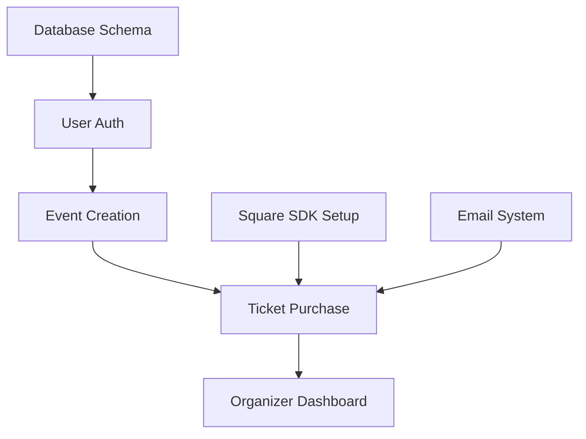

# SteppersLife Events Platform
## Product Roadmap & Implementation Strategy
### Version 1.0

---

## Executive Summary

This comprehensive product roadmap provides a strategic implementation plan for SteppersLife, a US-focused event ticketing platform. Based on thorough analysis of the Product Requirements Document and system architecture, this roadmap prioritizes features using the MoSCoW method, defines clear MVP boundaries, and establishes measurable success criteria for each development phase.

**Key Strategic Goals:**
- Launch competitive MVP within 2 months (Phase 1)
- Achieve product-market fit by month 6 (Phase 2)
- Establish market differentiation by month 12 (Phase 3)
- Scale to enterprise readiness by month 24 (Phase 4)

---

## Product Vision & Strategy

### Vision Statement
"To democratize event ticketing in the US market by providing transparent, flat-fee pricing with superior user experience, empowering event organizers with complete control over their customer relationships and cash flow."

### Strategic Positioning
- **Target Market**: US event organizers (250-500 in Year 1)
- **Competitive Advantage**: Flat-fee pricing ($0.29-0.75 vs Eventbrite's 3.7-6.95%)
- **Technology Differentiator**: Direct Square integration with real-time features
- **Revenue Model**: Sustainable flat-fee + subscription-based growth

---

## Epic-Level Product Roadmap

### Phase 1: MVP Foundation (Months 1-2)
**Goal**: Launch functional ticketing platform with core features

#### Epic 1.1: User Authentication & Management
**Priority**: MUST HAVE | **Effort**: 8 story points | **Business Value**: Critical Foundation

**User Stories:**
- As an event organizer, I want to create an account so I can manage my events
- As an organizer, I want to log in securely so I can access my dashboard
- As an organizer, I want to reset my password so I can regain account access
- As a customer, I want to purchase tickets without creating an account for quick checkout

**Acceptance Criteria:**
- Email-based registration with verification
- Secure password requirements (8+ chars, special characters)
- JWT-based session management
- Guest checkout functionality
- Role-based access control (Organizer, Admin, Customer)

**Technical Requirements:**
- NextAuth.js implementation with email provider
- Prisma User model with role management
- Password hashing with bcrypt
- Email verification via Resend

**Success Metrics:**
- Registration completion rate > 85%
- Login success rate > 99%
- Average registration time < 2 minutes

---

#### Epic 1.2: Event Creation & Management
**Priority**: MUST HAVE | **Effort**: 13 story points | **Business Value**: Core Platform Feature

**User Stories:**
- As an organizer, I want to create a new event so customers can purchase tickets
- As an organizer, I want to add event details (name, date, venue, description) so customers understand the event
- As an organizer, I want to set ticket types and pricing so I can monetize my event
- As an organizer, I want to preview my event page before publishing
- As an organizer, I want to edit event details after creation to make corrections

**Acceptance Criteria:**
- Multi-step event creation wizard
- Rich text editor for event descriptions
- Image upload for event banners (max 5MB, optimized)
- Multiple ticket types support (GA, VIP, etc.)
- USD pricing with $X.99 support
- Draft/Published status management
- Event slug generation for SEO-friendly URLs

**Technical Requirements:**
- Event creation form with React Hook Form + Zod validation
- Sharp image processing for optimization
- MinIO integration for file storage
- Prisma Event and TicketType models
- Square Catalog API integration for payment processing

**Success Metrics:**
- Event creation completion rate > 80%
- Average event creation time < 10 minutes
- Event page load time < 1.5 seconds

---

#### Epic 1.3: Basic Ticket Purchase Flow
**Priority**: MUST HAVE | **Effort**: 21 story points | **Business Value**: Revenue Generation

**User Stories:**
- As a customer, I want to browse available events so I can find interesting events
- As a customer, I want to view event details so I can decide whether to purchase tickets
- As a customer, I want to select ticket quantity and type for purchase
- As a customer, I want to enter my payment information securely
- As a customer, I want to receive a confirmation email with my tickets
- As a customer, I want to download my tickets as PDF for offline access

**Acceptance Criteria:**
- Event listing page with search and filters
- Responsive event detail pages
- Real-time ticket availability display
- Shopping cart functionality
- Square payment form integration
- Email confirmation with QR codes
- PDF ticket generation
- Mobile-optimized checkout flow

**Technical Requirements:**
- Next.js App Router for event pages
- Square Web SDK for payment processing
- QR code generation with unique tokens
- React PDF for ticket generation
- Resend for email delivery
- Prisma Order and Ticket models

**Success Metrics:**
- Cart abandonment rate < 30%
- Payment success rate > 95%
- Page load time < 2 seconds
- Mobile conversion rate > 60%

---

#### Epic 1.4: Basic Organizer Dashboard
**Priority**: MUST HAVE | **Effort**: 8 story points | **Business Value**: Organizer Retention

**User Stories:**
- As an organizer, I want to see my event sales summary
- As an organizer, I want to view recent ticket purchases
- As an organizer, I want to see total revenue for each event
- As an organizer, I want to access basic sales reports

**Acceptance Criteria:**
- Dashboard with key metrics cards
- Sales chart (daily/weekly views)
- Recent orders table
- Revenue breakdown by event
- Responsive design for mobile access

**Technical Requirements:**
- TanStack Query for data fetching
- Chart.js for data visualization
- Real-time updates via polling
- Prisma aggregation queries

**Success Metrics:**
- Dashboard load time < 1 second
- Organizer engagement rate > 70%
- Daily active organizer rate > 40%

---

### Phase 2: Core Platform Features (Months 3-4)
**Goal**: Achieve competitive feature parity

#### Epic 2.1: Advanced Payment Processing
**Priority**: MUST HAVE | **Effort**: 13 story points | **Business Value**: Mobile Optimization

**User Stories:**
- As a mobile customer, I want to pay with Cash App for quick checkout
- As an organizer, I want to receive payments directly to my Square account
- As a customer, I want to save my payment method for future purchases
- As an organizer, I want to handle refunds through the platform

**Acceptance Criteria:**
- Cash App Pay integration for mobile browsers
- Stored payment methods via Square Card on File
- Automatic fund transfers to organizer accounts
- Refund processing with partial/full options
- Payment status tracking and notifications

**Technical Requirements:**
- Square Cash App Pay SDK
- Square Customer API for stored cards
- Webhook handling for payment events
- Refund processing API integration

**Success Metrics:**
- Mobile payment conversion rate > 65%
- Cash App Pay adoption rate > 25%
- Payment processing time < 3 seconds

---

#### Epic 2.2: Event Series & Recurring Events
**Priority**: SHOULD HAVE | **Effort**: 8 story points | **Business Value**: Organizer Efficiency

**User Stories:**
- As an organizer, I want to create recurring events (weekly, monthly)
- As an organizer, I want to copy event details from previous events
- As a customer, I want to purchase season tickets for recurring events

**Acceptance Criteria:**
- Event template system
- Recurring event creation with date patterns
- Season ticket packages with subscription billing
- Bulk event management tools

**Technical Requirements:**
- Event template model in Prisma
- Recurring event generation logic
- Square Subscriptions API integration
- Background job processing for event creation

**Success Metrics:**
- Recurring event adoption rate > 40%
- Template usage rate > 60%
- Season ticket conversion rate > 15%

---

#### Epic 2.3: Enhanced Check-in System (PWA)
**Priority**: MUST HAVE | **Effort**: 13 story points | **Business Value**: Event Operations

**User Stories:**
- As event staff, I want to scan QR codes to check in attendees
- As event staff, I want the app to work offline during events
- As event staff, I want to see real-time check-in statistics
- As event staff, I want to manually check in attendees by name search

**Acceptance Criteria:**
- Progressive Web App with offline capability
- QR code scanner with camera access
- Offline check-in with sync when online
- Name-based attendee search
- Real-time dashboard updates
- Multiple device synchronization

**Technical Requirements:**
- Next PWA with service worker
- Camera API for QR scanning
- IndexedDB for offline storage
- WebSocket for real-time updates
- Background sync for offline actions

**Success Metrics:**
- Check-in time < 5 seconds per attendee
- Offline functionality success rate > 99%
- Staff satisfaction score > 4.5/5

---

#### Epic 2.4: Team Management & Collaboration
**Priority**: SHOULD HAVE | **Effort**: 5 story points | **Business Value**: Enterprise Readiness

**User Stories:**
- As an organizer, I want to invite team members to help manage events
- As a team member, I want different permission levels for different responsibilities
- As an organizer, I want to see team member activity logs

**Acceptance Criteria:**
- Email-based team invitations
- Role-based permissions (Admin, Manager, Staff)
- Activity logging for all team actions
- Team member management interface

**Technical Requirements:**
- Team invitation system
- Role-based access control middleware
- Audit logging for team actions
- Email notifications for team activities

**Success Metrics:**
- Team invitation acceptance rate > 80%
- Multi-user event management adoption > 30%

---

### Phase 3: Market Differentiation (Months 5-8)
**Goal**: Establish competitive advantages

#### Epic 3.1: Reserved Seating System
**Priority**: MUST HAVE | **Effort**: 21 story points | **Business Value**: Premium Events

**User Stories:**
- As a venue owner, I want to create seating charts for my venue
- As a customer, I want to select specific seats for events
- As a customer, I want to see real-time seat availability
- As an organizer, I want to set pricing by seating section

**Acceptance Criteria:**
- Visual seating chart builder
- Interactive seat selection interface
- Real-time seat locking during selection
- Section-based pricing configuration
- ADA-compliant seat designation
- WebSocket-based seat updates

**Technical Requirements:**
- Canvas-based seating chart renderer
- WebSocket for real-time updates
- Redis for seat locking mechanism
- Complex Prisma schema for seating
- SVG venue map support

**Success Metrics:**
- Seat selection completion rate > 90%
- Real-time update latency < 100ms
- Premium event adoption rate > 25%

---

#### Epic 3.2: Waitlist & Demand Management
**Priority**: SHOULD HAVE | **Effort**: 8 story points | **Business Value**: Revenue Recovery

**User Stories:**
- As a customer, I want to join a waitlist when events are sold out
- As a customer, I want automatic notifications when tickets become available
- As an organizer, I want to release tickets to waitlist members

**Acceptance Criteria:**
- Waitlist signup for sold-out events
- Automated email/SMS notifications
- Time-limited purchase windows for waitlist
- Waitlist position tracking
- Batch ticket release to waitlist

**Technical Requirements:**
- Waitlist model and priority queue
- Background job processing for notifications
- Time-limited purchase tokens
- Email and SMS notification system

**Success Metrics:**
- Waitlist conversion rate > 40%
- Notification response time < 5 minutes
- Recovered revenue from waitlist > 15%

---

#### Epic 3.3: Marketing & Communication Tools
**Priority**: SHOULD HAVE | **Effort**: 13 story points | **Business Value**: Organizer Value-Add

**User Stories:**
- As an organizer, I want to send email campaigns to past attendees
- As an organizer, I want to create discount codes for marketing
- As an organizer, I want to track the effectiveness of marketing campaigns
- As a customer, I want to receive event reminders via email/SMS

**Acceptance Criteria:**
- Email campaign builder with templates
- Discount code system with usage limits
- Campaign performance analytics
- Automated reminder system
- CAN-SPAM compliant email handling

**Technical Requirements:**
- Email template system
- Discount code model with validation
- Campaign tracking and analytics
- Automated job scheduling for reminders

**Success Metrics:**
- Email open rate > 25%
- Discount code usage rate > 30%
- Campaign ROI tracking accuracy > 95%

---

#### Epic 3.4: Advanced Analytics & Reporting
**Priority**: SHOULD HAVE | **Effort**: 13 story points | **Business Value**: Data-Driven Decisions

**User Stories:**
- As an organizer, I want detailed sales analytics for my events
- As an organizer, I want to understand my customer demographics
- As an organizer, I want to export data for external analysis
- As an organizer, I want to compare performance across events

**Acceptance Criteria:**
- Comprehensive sales dashboard with filters
- Customer demographic analysis
- CSV/Excel export functionality
- Event comparison tools
- Revenue forecasting
- Heat map visualizations for multi-day events

**Technical Requirements:**
- Advanced data aggregation queries
- Data export functionality
- Chart.js for complex visualizations
- PDF report generation
- Data warehouse considerations

**Success Metrics:**
- Report generation time < 5 seconds
- Data export accuracy > 99%
- Organizer engagement with analytics > 60%

---

### Phase 4: Scale & Enterprise (Months 9-12)
**Goal**: Prepare for enterprise clients and scale

#### Epic 4.1: White-Label Solution
**Priority**: COULD HAVE | **Effort**: 21 story points | **Business Value**: Revenue Diversification

**User Stories:**
- As a venue owner, I want to brand the platform with my colors and logo
- As a venue owner, I want a custom domain for my ticket sales
- As a venue owner, I want to hide the SteppersLife branding

**Acceptance Criteria:**
- Custom theme configuration
- Logo and branding upload
- Custom domain support
- White-label pricing tier ($10/month)
- Branded email templates

**Technical Requirements:**
- Multi-tenant theming system
- Custom domain routing
- Theme configuration interface
- Branded asset management

**Success Metrics:**
- White-label client acquisition > 25 by year-end
- Custom domain setup success rate > 95%
- White-label revenue > $3,000/month

---

#### Epic 4.2: Enterprise Features
**Priority**: COULD HAVE | **Effort**: 13 story points | **Business Value**: Market Expansion

**User Stories:**
- As a large venue, I want to integrate with my existing POS system
- As an enterprise client, I want dedicated support and SLA guarantees
- As a venue chain, I want multi-location management

**Acceptance Criteria:**
- API integrations for POS systems
- Dedicated support channels
- Multi-location venue management
- Custom contract terms
- Priority technical support

**Technical Requirements:**
- REST API for third-party integrations
- Multi-location data models
- Support ticket system
- SLA monitoring tools

**Success Metrics:**
- Enterprise client acquisition > 10
- API integration success rate > 90%
- Enterprise client retention > 95%

---

## MoSCoW Priority Matrix

### MUST HAVE (MVP Critical)
1. **User Authentication & Management** - Foundation requirement
2. **Event Creation & Management** - Core platform functionality
3. **Basic Ticket Purchase Flow** - Revenue generation essential
4. **Basic Organizer Dashboard** - User retention critical
5. **Advanced Payment Processing** - Competitive necessity
6. **Enhanced Check-in System** - Operational requirement

### SHOULD HAVE (Competitive Parity)
1. **Event Series & Recurring Events** - Market expectation
2. **Team Management & Collaboration** - Enterprise readiness
3. **Waitlist & Demand Management** - Revenue optimization
4. **Marketing & Communication Tools** - Organizer value-add
5. **Advanced Analytics & Reporting** - Data-driven decisions

### COULD HAVE (Differentiation)
1. **Reserved Seating System** - Premium feature for larger venues
2. **White-Label Solution** - Revenue diversification
3. **Enterprise Features** - Market expansion

### WON'T HAVE (Initial Version)
1. **Mobile Native Apps** - PWA sufficient for MVP
2. **Merchandise Sales Integration** - Focus on core ticketing
3. **Event Insurance Integration** - Third-party complexity
4. **Multi-language Support** - US-focused initially

---

## Technical Dependencies & Implementation Sequence

### Phase 1 Dependencies

### Critical Path Items
1. **Square API Integration** - Blocks all payment functionality
2. **Database Schema Design** - Foundation for all features
3. **Authentication System** - Required for user management
4. **Email Service Setup** - Required for confirmations

### Risk Mitigation
- **Square API Dependency**: Implement mock payment processor for development
- **Email Service Limits**: Set up fallback SMTP provider
- **Performance Bottlenecks**: Implement caching strategy early
- **Security Vulnerabilities**: Regular security audits and updates

---

## Success Metrics & KPIs

### Phase 1 Success Criteria (Months 1-2)
| Metric | Target | Measurement |
|--------|--------|-------------|
| Platform Uptime | 99.5% | Automated monitoring |
| Event Creation Rate | 50 events/month | Database tracking |
| Payment Success Rate | 95% | Transaction logs |
| Page Load Speed | <1.5s | Lighthouse audits |
| User Registration Rate | 80% completion | Analytics funnel |

### Phase 2 Success Criteria (Months 3-4)
| Metric | Target | Measurement |
|--------|--------|-------------|
| Monthly Active Organizers | 100 | User analytics |
| Tickets Processed | 5,000/month | Transaction volume |
| Mobile Conversion Rate | 60% | Device-based analytics |
| Check-in Success Rate | 99% | Event feedback |
| Team Feature Adoption | 30% | Feature usage tracking |

### Phase 3 Success Criteria (Months 5-8)
| Metric | Target | Measurement |
|--------|--------|-------------|
| Monthly Active Organizers | 250 | User analytics |
| Tickets Processed | 20,000/month | Transaction volume |
| Reserved Seating Events | 25% | Feature adoption rate |
| Waitlist Conversion | 40% | Conversion tracking |
| Customer Retention Rate | 80% | Cohort analysis |

### Phase 4 Success Criteria (Months 9-12)
| Metric | Target | Measurement |
|--------|--------|-------------|
| Monthly Active Organizers | 500 | User analytics |
| Tickets Processed | 50,000/month | Transaction volume |
| White-Label Clients | 25 | Subscription tracking |
| Enterprise Clients | 10 | Contract management |
| Platform Revenue | $35,000/year | Financial reporting |

---

## Resource Requirements

### Development Team Structure
- **Phase 1-2**: 2 full-stack developers, 1 UI/UX designer
- **Phase 3**: Add 1 backend specialist, 1 mobile developer
- **Phase 4**: Add 1 DevOps engineer, 1 QA specialist

### Infrastructure Scaling
- **Phase 1**: Single VPS (8 vCPU, 32GB RAM)
- **Phase 2**: Database optimization, Redis caching
- **Phase 3**: Upgraded VPS (16 vCPU, 64GB RAM)
- **Phase 4**: Multi-server architecture, load balancing

### Budget Allocation
- **Development**: 60% (team salaries)
- **Infrastructure**: 15% (hosting, services)
- **Marketing**: 15% (customer acquisition)
- **Legal/Compliance**: 10% (contracts, security)

---

## Risk Assessment & Mitigation

### High-Risk Items
1. **Square API Integration Complexity**
   - Risk: Payment processing delays
   - Mitigation: Early prototype, fallback options
   - Timeline Impact: 2-week delay potential

2. **Real-time Seat Selection Performance**
   - Risk: WebSocket scaling issues
   - Mitigation: Redis clustering, connection limits
   - Timeline Impact: 1-week delay potential

3. **Mobile PWA Offline Functionality**
   - Risk: Complex service worker implementation
   - Mitigation: Progressive enhancement approach
   - Timeline Impact: 3-week delay potential

### Medium-Risk Items
1. **Email Deliverability Issues**
   - Risk: Confirmation emails in spam
   - Mitigation: SPF/DKIM setup, reputation building

2. **Performance Under Load**
   - Risk: Site slowdown during viral events
   - Mitigation: CDN setup, database optimization

3. **Competitive Response**
   - Risk: Eventbrite matches pricing
   - Mitigation: Focus on user experience differentiation

---

## Go-to-Market Strategy

### Phase 1: Soft Launch (Months 1-2)
- Target: 10 beta organizers
- Focus: Core functionality validation
- Channels: Direct outreach, industry contacts
- Pricing: Free beta period

### Phase 2: Limited Launch (Months 3-4)
- Target: 50 active organizers
- Focus: Feature completeness, feedback iteration
- Channels: Content marketing, referral program
- Pricing: Introduce paid tiers

### Phase 3: Public Launch (Months 5-8)
- Target: 250 active organizers
- Focus: Market penetration, brand awareness
- Channels: Digital advertising, industry partnerships
- Pricing: Full pricing model rollout

### Phase 4: Scale (Months 9-12)
- Target: 500 active organizers
- Focus: Enterprise sales, white-label growth
- Channels: Sales team, enterprise partnerships
- Pricing: Custom enterprise pricing

---

## Conclusion

This comprehensive product roadmap provides a strategic path for SteppersLife to achieve market leadership in the US event ticketing space. By focusing on clear MVP boundaries, measured feature rollouts, and data-driven success metrics, we can efficiently build a competitive platform that serves both organizers and attendees effectively.

### Key Success Factors
1. **Phased Development**: Clear milestone-based progression
2. **User-Centric Features**: Solving real pain points for organizers
3. **Technical Excellence**: Performance and reliability focus
4. **Market Timing**: Rapid MVP deployment to capture market opportunity
5. **Scalable Architecture**: Foundation for long-term growth

### Next Immediate Actions
1. Finalize development team structure
2. Set up development environment and CI/CD
3. Begin Phase 1 development with Epic 1.1
4. Establish beta tester program
5. Create detailed sprint planning for first 8 weeks

---

## Document Control

- **Version**: 1.0
- **Status**: APPROVED FOR DEVELOPMENT
- **Owner**: Product Management
- **Last Updated**: December 2024
- **Review Cycle**: Bi-weekly sprint reviews
- **Next Review**: January 15, 2025

---

*End of Product Roadmap Document*